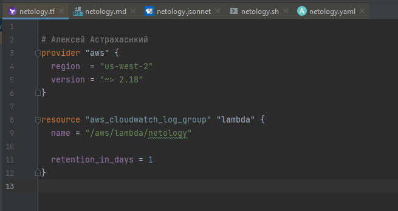
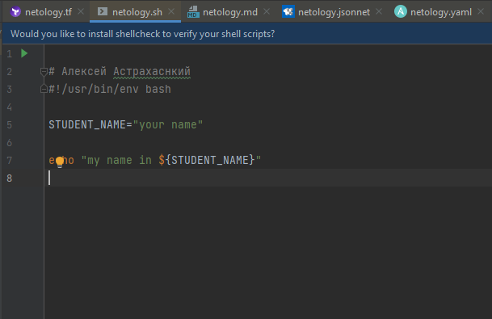
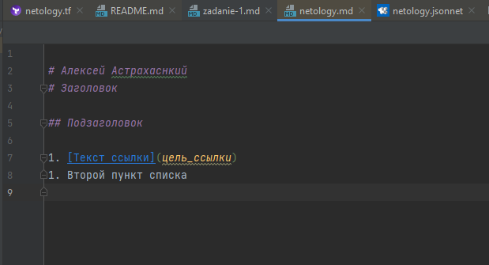
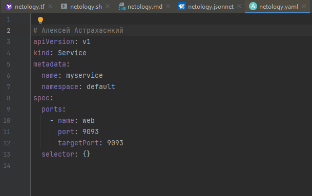
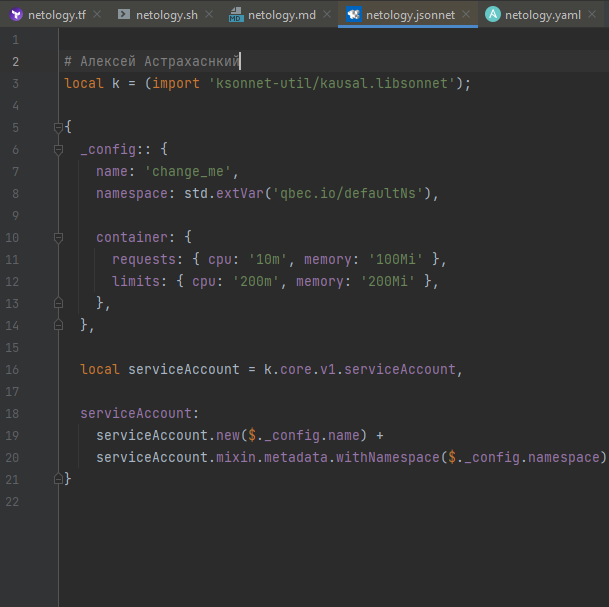
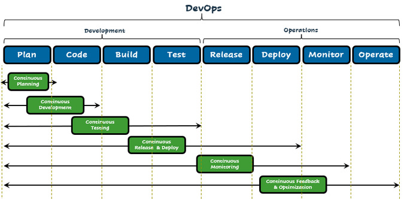

## Домашнее задание Алексей Астраханский

### Задание - 1

###### Tarraform:

###### Bash:

###### MarkDown:

###### Yaml:

###### Jsonnet:

### Задание - 2

1. Встреча заказчика с менеджером, определение потребностей, формирование тз.
2. Встреча менеджера с разработчиками и DevOps, определение требований к инфраструктуре и требований к ПО, выбор инструментов разработки. 
3. DevOps: развертываение инфраструктуры. Dev- контур разработки, test- контур тестирования, prod- продуктивный контур. Настройка бэкапов. 
4. Разработчики: Этап разработки и внутреннего тестирования 
5. Передача продукта для тестирования.
6. Презентация продукат заказчику 
7. Deploy
8. Мониторинг

