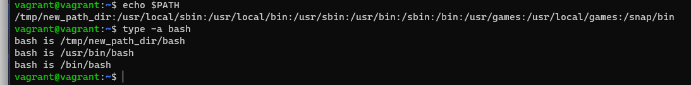

#### Домашнее задание к занятию "3.1. Работа в терминале, лекция 1"

1. Установил VirtualBox
2. Установил Vagrant 
3. Запустил Windows Terminal в Windows
4. Создал папку для конфигов Vagrant
	* Запустил команду Vagrant init bento/ubuntu-20.04
	* Открыл Vagrantfile, ознакомился с содержимым
	* Запустил комнаду vagrant up, получил ошибку, добавил бродягу в исключения антивируса
	* Еще раз запустил команду, box скачался и установился, виртуальная машина запустилась
5. Ресурсы:
	* RAM - 1024 MB
	* CPU - 2 ядра
	* GPU - 4 MB
	* VHDD - 64 GB
	* LAN - 1 Gb
6. Ознакомился с документацией:
	* Остановил виртуальную машину
	* Открыл конфиг файл vagrantfile
	* Расширил память и cpu виртульной машины строчками 
	* config.vm.provider "virtualbox" do |v|
  	* v.memory = 2048
  	* v.cpus = 3 

7. Подключился с помощью vagrant ssh
8. Длина журнала задается переменной HISTSIZE (строчка в man bash 796)
	* Пример: HISTSIZE=500 (задает значение в текущей сессии) 
	* Чтоб задать значение на постоянной сонове нужно добавить строчку export HISTSIZE=600 в файл с историей, либо выполнить команду echo "export HISTSIZE=600" >> ~/.bashrc
	* ignoreboth - включает в себя две директивы (ignoredups и ignorespace) игнормрует дубликаты комманд и не записывает команды начинающиеся с пробела
	включается командой echo "export HISTCONTROL=ignoreboth" >>~/.bashrc
9. Скобки расширения строка 978
10. С помощью команды touch filename_{1..100000}, 300000 файлов создать невозможно выдает ошибку. Максимально получилось создать одной командой 110293 файла. Причину найти не удалось.
11. [[ -d /tmp ]] - данная конструкция проверяет наличие каталога в системе
12. Создал директорию: mkdir /tmp/new_path_dir, скопировал файл bash cp /bin/bash /tmp/new_path_dir, добавил новое расположение bash в /etc/enviroment в самое начлао пути.
	
13. batch и at - это команды выполнения заданий по расписанию, разница заключается в том, что команда batch выполняет задания если уровень загруузки системы не привышает 0,8% (значение по умолчанию)    
