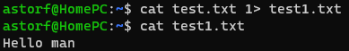
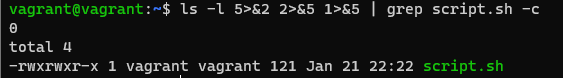

### Домашнее задание к занятию "3.2. Работа в терминале, лекция 2"
1. Команда cd является встроенной комнадой linux
2. $ grep -c <some_string> <some_file>
3. systemd(1)─
4. $ ll > /dev/pts/1
5. Командой $ cat test.txt 1> test1.txt

     
6. Получится. Пример команды $ sudo ls -l  > /dev/tty3
7. Команда bash 5>&1 - Создаст дескриптор 5 и перенатправит его в stdout
     * команда echo netology > /proc/$$/fd/5 - перенаправит в дескриптор 5, который был ранее пернеаправлен в stdout, соответсвенно произойдет вывод команды в stdout

8. $ ls -l 5>&2 2>&5 1>&5 | grep script.sh -c
  
     
9. Команда выводит переменные окружения, так же можно вывести командой env и printenv

10. 
     * /proc/PID/cmdline - Аргументы командной строки процесса 
     * /proc/PID/exe - символическая ссылка на абсолютную директорю бинарного файла
11. SSE 4.2
12. Псевдо-терминал не будет выделен. ssh сначала ожидает сеанса входа в систему (который потребует выделения pty на удаленном хосте), но затем должен понять, что его локальный стандартный ввод не является tty. Решить это можно с помощью добавления аргумента -t принудительным выделением pty
     * vagrant@vagrant:~$ ssh -t localhost 'tty'
       * $ /dev/pts/2
       * $ Connection to localhost closed.

13. С помощью reptyr удалось перенести процес запущенного скртипта с бесконечно повторяющимся циклом вывода строки из одной сессии в screen процесс другой. Используемые команды:
     * $ screen -S test_session
     * $ sudo reptyr -T PID
     Не удалось переместить процесс запущенного openvpn-клиента, а так же комнду Ping- ошибка Permission denied. В интернете особо информации не нашел, кроме как поправить значение kernel.yama.ptrace_scope = 0
          * p.s. Прошу пояснить почему почему не получается переносить ткие команды. 
14.  Команда tee в Linux нужна для записи вывода любой команды в один или несколько файлов, с одновременным выводом stdout. В таком случае комнда echo перенаправит через pipe свой stdout в в stdin команды tee, которая будет запущена с повышением прав через sudo, соответсвенно доступ на запись файла будет разрешен. 