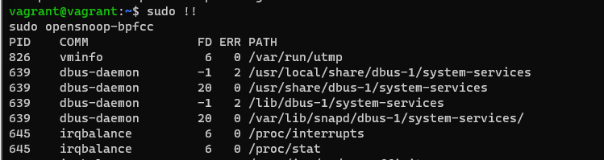

### Домашнее задание к занятию "3.3. Операционные системы, лекция 1"
1. Cистемный вызов команды CD - chdir("/tmp")
2. Команда File обращеается к символической ссылке по следующему пути /usr/share/misc/magic.mgc, сам файл magic.mgc лежит тут /lib/file/magic.mgc
3. Файл дескриптор можно очистить с помощью команды: $ cat /dev/null > /proc/PID/1
4. Зомби процессы освобождают ресурсы свои ресурсы, но остаются в таблице процессов, что в свою очередьмодет помешать открытию новых процессов.
5. Вывод трассировки системных вызовов open
    
6. uname -a использует syscall uname()
* man 2 uname
   * Part of the utsname information is also accessible  via  /proc/sys/kernel/{ostype,
       hostname, osrelease, version, domainname}.


7. * Символы ; и && называются операторами объединения команд, в первом случае команды будут выполнены последовательно, во втором команда будет выполнена в случае если первая завершится успешно.  
* Совместное использование set -e и && имеет смысл если необходимо выполнить несколько команд последоватльно и чтоб закртытие оболочки произошло только в случае ошибки на последней команде.

Пример: 
   

8. set -euxo pipefail - очень полезен при написании сценариев.
* Параметр -e если любая команда выйдет с ошибкой, скрипт немедленно завершит работу.
* Параметр -u проверяет инициализацию переменных в скрипте. Если переменной не будет, скрипт немедленно завершиться.
* Параметр -x печатает в стандартный вывод все команды перед их исполнением.
* Параметр -o pipefail если нужно убедиться, что все команды в пайпах завершились успешно.

9. При выводе команды ps -ao stat преобладают спящие процессы со значением S и I - Idle kernel thread бездействующие потоки ядра. Доп символы чаще всего символизируют приоритет процесса.


### Вопросы:

1. Какой системный вызов делает команда `cd`? В прошлом ДЗ мы выяснили, что `cd` не является самостоятельной  программой, это `shell builtin`, поэтому запустить `strace` непосредственно на `cd` не получится. Тем не менее, вы можете запустить `strace` на `/bin/bash -c 'cd /tmp'`. В этом случае вы увидите полный список системных вызовов, которые делает сам `bash` при старте. Вам нужно найти тот единственный, который относится именно к `cd`.
2. Попробуйте использовать команду `file` на объекты разных типов на файловой системе. Например:
    ```bash
    vagrant@netology1:~$ file /dev/tty
    /dev/tty: character special (5/0)
    vagrant@netology1:~$ file /dev/sda
    /dev/sda: block special (8/0)
    vagrant@netology1:~$ file /bin/bash
    /bin/bash: ELF 64-bit LSB shared object, x86-64
    ```
    Используя `strace` выясните, где находится база данных `file` на основании которой она делает свои догадки.
3. Предположим, приложение пишет лог в текстовый файл. Этот файл оказался удален (deleted в lsof), однако возможности сигналом сказать приложению переоткрыть файлы или просто перезапустить приложение – нет. Так как приложение продолжает писать в удаленный файл, место на диске постепенно заканчивается. Основываясь на знаниях о перенаправлении потоков предложите способ обнуления открытого удаленного файла (чтобы освободить место на файловой системе).
4. Занимают ли зомби-процессы какие-то ресурсы в ОС (CPU, RAM, IO)?
5. В iovisor BCC есть утилита `opensnoop`:
    ```bash
    root@vagrant:~# dpkg -L bpfcc-tools | grep sbin/opensnoop
    /usr/sbin/opensnoop-bpfcc
    ```
    На какие файлы вы увидели вызовы группы `open` за первую секунду работы утилиты? Воспользуйтесь пакетом `bpfcc-tools` для Ubuntu 20.04. Дополнительные [сведения по установке](https://github.com/iovisor/bcc/blob/master/INSTALL.md).
6. Какой системный вызов использует `uname -a`? Приведите цитату из man по этому системному вызову, где описывается альтернативное местоположение в `/proc`, где можно узнать версию ядра и релиз ОС.
7. Чем отличается последовательность команд через `;` и через `&&` в bash? Например:
    ```bash
    root@netology1:~# test -d /tmp/some_dir; echo Hi
    Hi
    root@netology1:~# test -d /tmp/some_dir && echo Hi
    root@netology1:~#
    ```
    Есть ли смысл использовать в bash `&&`, если применить `set -e`?
8. Из каких опций состоит режим bash `set -euxo pipefail` и почему его хорошо было бы использовать в сценариях?
9. Используя `-o stat` для `ps`, определите, какой наиболее часто встречающийся статус у процессов в системе. В `man ps` ознакомьтесь (`/PROCESS STATE CODES`) что значат дополнительные к основной заглавной буквы статуса процессов. Его можно не учитывать при расчете (считать S, Ss или Ssl равнозначными).

 
