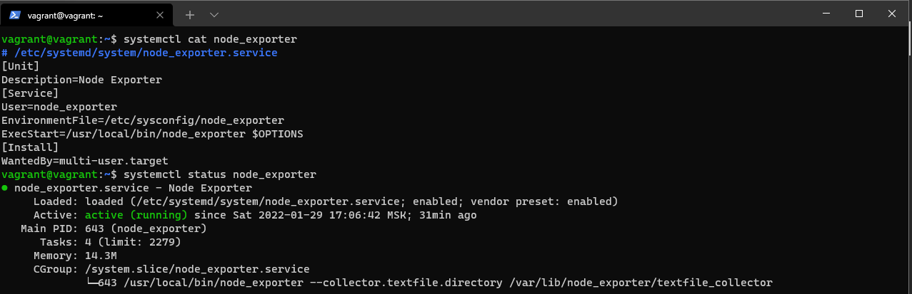
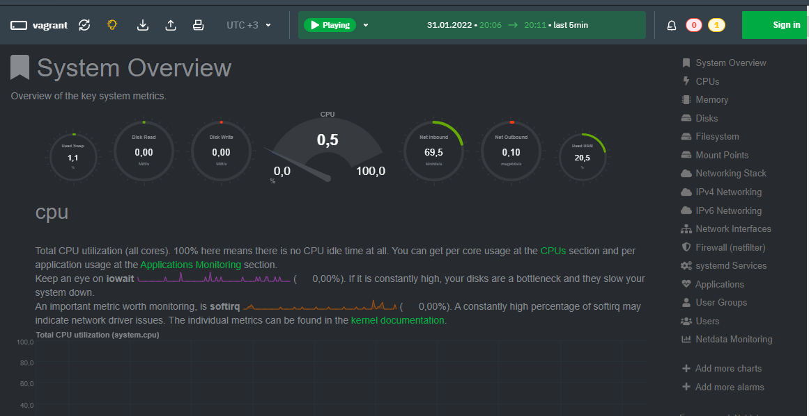
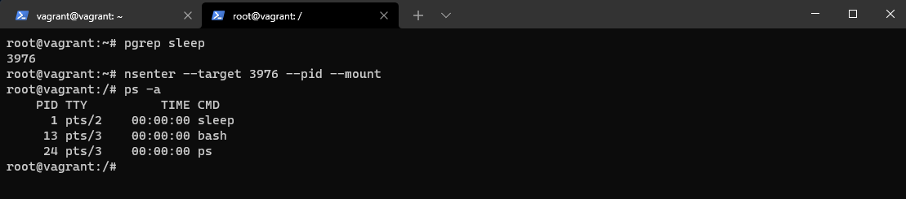

### `Домашнее задание к занятию "3.4. Операционные системы, лекция 2"`

1.  На скрине показан вывод конфигурации unit файла и статус сервиса `node_exporter`

    

2. `node_extender` metrics
    ```
    CPU
    * process_cpu_seconds_total
    * node_cpu_seconds_total{cpu="0",mode="iowait"}
    * node_cpu_seconds_total{cpu="0",mode="system"}
    * node_cpu_seconds_total{cpu="0",mode="user"}
    * node_cpu_seconds_total{cpu="0",mode="idle"} 
    
    MEM
    * node_memory_MemTotal_bytes 
    * node_memory_MemFree_bytes
    * node_memory_Cached_bytes
    * node_memory_Buffers_bytes
    
    DISK 
    * node_disk_read_bytes_total{device="sda"} 
    * node_disk_read_time_seconds_total{device="sda"}
    * node_disk_write_time_seconds_total{device="sda"}
    * node_disk_io_time_seconds_total{device="sda"}
    
    NET
    * node_network_speed_bytes{device="eth0"}
    * node_network_receive_bytes_total{device="eth0"}
    * node_network_transmit_bytes_total{device="eth0"}
    * node_network_receive_errs_total
    * node_network_transmit_errs_total

3. `NETDATA` установлена, порты проброшены с хостовой машины 

    

4. Да, ОС осознает, что запущена на системе виртуализации 
   ```
    * [    0.000000] Hypervisor detected: KVM
    * [    0.006219] CPU MTRRs all blank - virtualized system
    * [    0.063279] Booting paravirtualized kernel on KVM 
    * [   18.942279] systemd[1]: Detected virtualization oracle.

5. `fs.nr_open = 1048576` - Лимит на колличество максимально открытых файл дескрипторов в системе (Hard limit). Soft limit не позволит достичь границ ыерхнего чилса Hard limit если установлено меньшее число.
Посмотреть значения можно так:
     ```
      Hard: 
      ulimit -Hn
      
      Soft:
      ulimit -Sn 
6. `Namespaces` Используемые команды:
    ```
    unshare -f --mount-proc --pid sleep 10m (запуск процесса sleep в отдельном namespaces)
    
    nsenter --target 3976 --pid --mount (подключение в namespaces по PID)
    ```
            

7. `:(){ :|:& };:` - Это fork bomb, которая бесконечно порождает новые процессы в системе, тем самым пожирая ресурсы ПК пока не упрется в максимальное значение. При запуске на ноутбуке система перестала отвечать, пришлось перезагружать. Для предотвращения полного расхода ресурсов необходимо осуществить принудительное ограничение количества процессов, которые пользователь может запустить одновременно. Также могут быть ограничены количество выделяемой виртуальной памяти и другие системные ресурсы. 
    ```
    ulimit -Su 50 - установка ограничений пользоватлю на колличество процессов (текущая сессия)
    На постоянной основе нужно отредактировать файл /etc/security/limits.conf


`### Вопросы:`

1. На лекции мы познакомились с [node_exporter](https://github.com/prometheus/node_exporter/releases). В демонстрации его исполняемый файл запускался в background. Этого достаточно для демо, но не для настоящей production-системы, где процессы должны находиться под внешним управлением. Используя знания из лекции по systemd, создайте самостоятельно простой [unit-файл](https://www.freedesktop.org/software/systemd/man/systemd.service.html) для node_exporter:

    * поместите его в автозагрузку,
    * предусмотрите возможность добавления опций к запускаемому процессу через внешний файл (посмотрите, например, на `systemctl cat cron`),
    * удостоверьтесь, что с помощью systemctl процесс корректно стартует, завершается, а после перезагрузки автоматически поднимается.

1. Ознакомьтесь с опциями node_exporter и выводом `/metrics` по-умолчанию. Приведите несколько опций, которые вы бы выбрали для базового мониторинга хоста по CPU, памяти, диску и сети.
1. Установите в свою виртуальную машину [Netdata](https://github.com/netdata/netdata). Воспользуйтесь [готовыми пакетами](https://packagecloud.io/netdata/netdata/install) для установки (`sudo apt install -y netdata`). После успешной установки:
    * в конфигурационном файле `/etc/netdata/netdata.conf` в секции [web] замените значение с localhost на `bind to = 0.0.0.0`,
    * добавьте в Vagrantfile проброс порта Netdata на свой локальный компьютер и сделайте `vagrant reload`:

    ```bash
    config.vm.network "forwarded_port", guest: 19999, host: 19999
    ```

    После успешной перезагрузки в браузере *на своем ПК* (не в виртуальной машине) вы должны суметь зайти на `localhost:19999`. Ознакомьтесь с метриками, которые по умолчанию собираются Netdata и с комментариями, которые даны к этим метрикам.

1. Можно ли по выводу `dmesg` понять, осознает ли ОС, что загружена не на настоящем оборудовании, а на системе виртуализации?
1. Как настроен sysctl `fs.nr_open` на системе по-умолчанию? Узнайте, что означает этот параметр. Какой другой существующий лимит не позволит достичь такого числа (`ulimit --help`)?
1. Запустите любой долгоживущий процесс (не `ls`, который отработает мгновенно, а, например, `sleep 1h`) в отдельном неймспейсе процессов; покажите, что ваш процесс работает под PID 1 через `nsenter`. Для простоты работайте в данном задании под root (`sudo -i`). Под обычным пользователем требуются дополнительные опции (`--map-root-user`) и т.д.
1. Найдите информацию о том, что такое `:(){ :|:& };:`. Запустите эту команду в своей виртуальной машине Vagrant с Ubuntu 20.04 (**это важно, поведение в других ОС не проверялось**). Некоторое время все будет "плохо", после чего (минуты) – ОС должна стабилизироваться. Вызов `dmesg` расскажет, какой механизм помог автоматической стабилизации. Как настроен этот механизм по-умолчанию, и как изменить число процессов, которое можно создать в сессии?