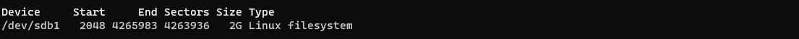
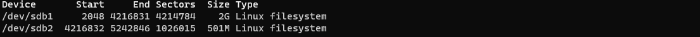
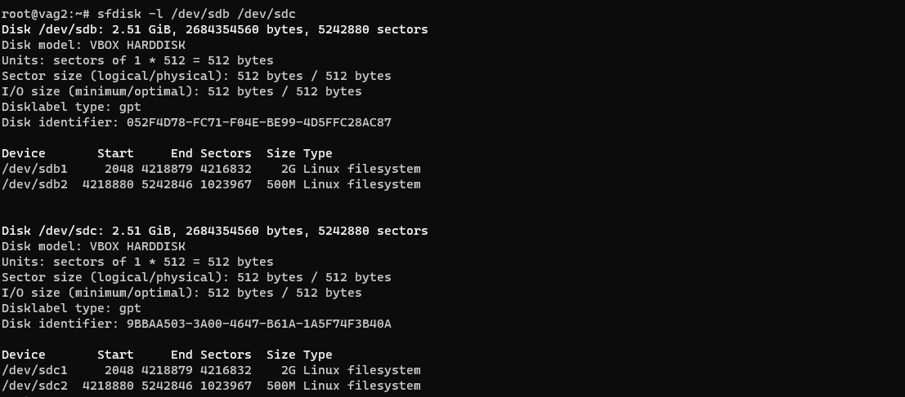
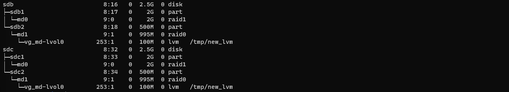
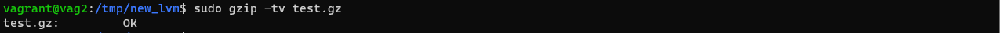
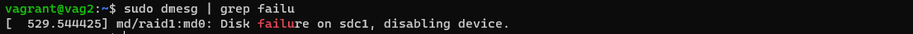

### Домашнее задание к занятию "3.5. Файловые системы"

1. Ознакомился техноогией разряженных файлов. Технология интересная, попробую однажды применить на практике
2. Hardlink является полной копией файла на который ссылается с идентичным inode и правами доступа. 
3. Создадим новую виртуальную машину с дополнительными дисками средсвами Vagrant
    ```bash
    Vagrant.configure("2") do |config|
      config.vm.box = "bento/ubuntu-20.04"
      config.vm.provider :virtualbox do |vb|
        lvm_experiments_disk0_path = "/tmp/lvm_experiments_disk0.vmdk"
        lvm_experiments_disk1_path = "/tmp/lvm_experiments_disk1.vmdk"
        vb.customize ['createmedium', '--filename', lvm_experiments_disk0_path, '--size', 2560]
        vb.customize ['createmedium', '--filename', lvm_experiments_disk1_path, '--size', 2560]
        vb.customize ['storageattach', :id, '--storagectl', 'SATA Controller', '--port', 1, '--device', 0, '--type', 'hdd', '--medium', lvm_experiments_disk0_path]
        vb.customize ['storageattach', :id, '--storagectl', 'SATA Controller', '--port', 2, '--device', 0, '--type', 'hdd', '--medium', lvm_experiments_disk1_path]
      end
    end
    ```
4. Сперва проверим доступные диски 
    
    ```
    sudo fdisk -l   
    ```
    * зайдем в интерактивный режим 
    
    ```
    sudo fdisk /dev/sdb
    ```
* создадим GPT таблицу разделов с помощью буквы `g`
* создадим раздел `sdb1` на 2GB с помощью буквы `n`
    
    
    
* проверим неразмеченное пространство с помощью буквы `F`
* создадим раздел `sdb2` на 500MB с помощью буквы `n`
    
    
5. Сделаем клон таблицы разделов на диск `sdc` и установим новый GUID 
    ```
    sudo sfdisk -d /dev/sdb > part_table.txt
    sudo sfdisk /dev/sdc < part_table.txt
    sudo sgdisk -G /dev/sdc
    ```
    

6. Создадим `RAID1` массив из разделов `sdb1 и sdc1`
    ```
   sudo mdadm --create /dev/md0 -l 1 --raid-devices 2 /dev/sdb1 /dev/sdc1 
7. Создадим `RAID0` массив из разделов `sdb2 и sdc2`
    ```
   sudo mdadm --create /dev/md1 -l 0 --raid-devices 2 /dev/sd{b2,c2} 
    ```
    Добавим информацию о `RAID` в файл mdadm.conf и пересоздадим initramfs с поддержкой этого массива
    ```
    echo 'DEVICE partitions containers' > /etc/mdadm/mdadm.conf
    
    mdadm --detail --scan >> /etc/mdadm/mdadm.conf

    update-initramfs -u
    ```
8. Создадим 2 независимых `PV` на получившихся md-устройствах
    ``` 
    sudo pvcreate /dev/md0 /dev/md1
    ```
9. Создадим общую `volume-group` на этих двух `PV`
    ```
    sudo vgcreate vg_md /dev/md{0,1}
    ```
10. Создадим `LV` размером `100 Мб`, указав его расположение на `PV` с `RAID0`.    
    ```
    sudo lvcreate -L 100M vg_md /dev/md1
    ```
11. Создадим `mkfs.ext4` ФС на получившемся `LV`
    ```    
    sudo mkfs.ext4 /dev/vg_md/lvol0
    ```
12. Смонтируем раздел в `/tmp/new_lvm/`   
    ```
    sudo mount /dev/vg_md/lvol0 /tmp/new_lvm/
    ```
13. Скопируем тестовый файл `test.gz` в `/tmp/new_lvm/` 
14. Вывод команды `lsblk`    

    
15. Протестируем целостность файла `test.gz`

    
16. Переместим содержимое `PV` с `RAID0` на `RAID1`
    ```
    sudo pvmove -v /dev/md1 /dev/md0
    ```
17. Пометим диск `sdc1` в состояние --Fail 
     ```
     sudo mdadm --manage /dev/md0 --fail /dev/sdc1
     ```
18. Вывод команды `dmesg` - RAID1 находится в неисправном состоянии

    
19. Протестируем целостность файла `test.gz`

        
20. 
    ```
    vagrant destroy    
    ```

 ### Вопросы:
1. Узнайте о [sparse](https://ru.wikipedia.org/wiki/%D0%A0%D0%B0%D0%B7%D1%80%D0%B5%D0%B6%D1%91%D0%BD%D0%BD%D1%8B%D0%B9_%D1%84%D0%B0%D0%B9%D0%BB) (разряженных) файлах.

1. Могут ли файлы, являющиеся жесткой ссылкой на один объект, иметь разные права доступа и владельца? Почему?

1. Сделайте `vagrant destroy` на имеющийся инстанс Ubuntu. Замените содержимое Vagrantfile следующим:

    ```bash
    Vagrant.configure("2") do |config|
      config.vm.box = "bento/ubuntu-20.04"
      config.vm.provider :virtualbox do |vb|
        lvm_experiments_disk0_path = "/tmp/lvm_experiments_disk0.vmdk"
        lvm_experiments_disk1_path = "/tmp/lvm_experiments_disk1.vmdk"
        vb.customize ['createmedium', '--filename', lvm_experiments_disk0_path, '--size', 2560]
        vb.customize ['createmedium', '--filename', lvm_experiments_disk1_path, '--size', 2560]
        vb.customize ['storageattach', :id, '--storagectl', 'SATA Controller', '--port', 1, '--device', 0, '--type', 'hdd', '--medium', lvm_experiments_disk0_path]
        vb.customize ['storageattach', :id, '--storagectl', 'SATA Controller', '--port', 2, '--device', 0, '--type', 'hdd', '--medium', lvm_experiments_disk1_path]
      end
    end
    ```

    Данная конфигурация создаст новую виртуальную машину с двумя дополнительными неразмеченными дисками по 2.5 Гб.

1. Используя `fdisk`, разбейте первый диск на 2 раздела: 2 Гб, оставшееся пространство.

1. Используя `sfdisk`, перенесите данную таблицу разделов на второй диск.

1. Соберите `mdadm` RAID1 на паре разделов 2 Гб.

1. Соберите `mdadm` RAID0 на второй паре маленьких разделов.

1. Создайте 2 независимых PV на получившихся md-устройствах.

1. Создайте общую volume-group на этих двух PV.

1. Создайте LV размером 100 Мб, указав его расположение на PV с RAID0.

1. Создайте `mkfs.ext4` ФС на получившемся LV.

1. Смонтируйте этот раздел в любую директорию, например, `/tmp/new`.

1. Поместите туда тестовый файл, например `wget https://mirror.yandex.ru/ubuntu/ls-lR.gz -O /tmp/new/test.gz`.

1. Прикрепите вывод `lsblk`.

1. Протестируйте целостность файла:

    ```bash
    root@vagrant:~# gzip -t /tmp/new/test.gz
    root@vagrant:~# echo $?
    0
    ```

1. Используя pvmove, переместите содержимое PV с RAID0 на RAID1.

1. Сделайте `--fail` на устройство в вашем RAID1 md.

1. Подтвердите выводом `dmesg`, что RAID1 работает в деградированном состоянии.

1. Протестируйте целостность файла, несмотря на "сбойный" диск он должен продолжать быть доступен:

    ```bash
    root@vagrant:~# gzip -t /tmp/new/test.gz
    root@vagrant:~# echo $?
    0
    ```

1. Погасите тестовый хост, `vagrant destroy`.