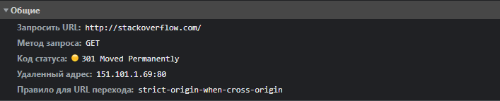
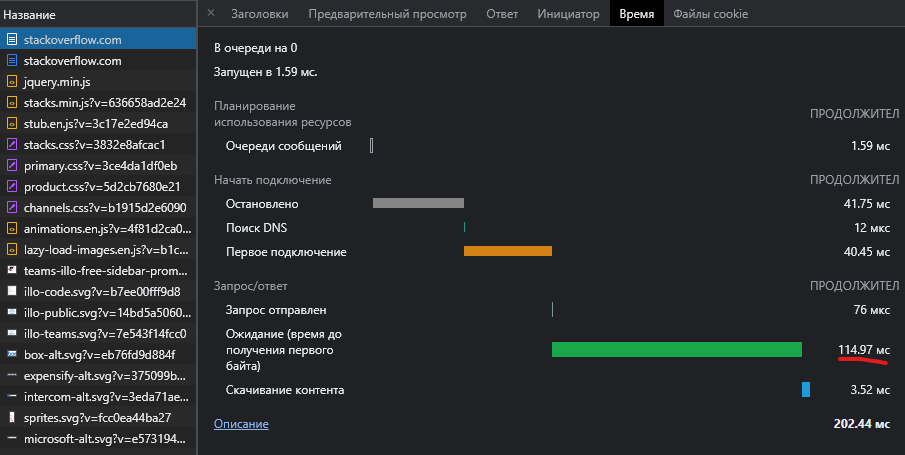
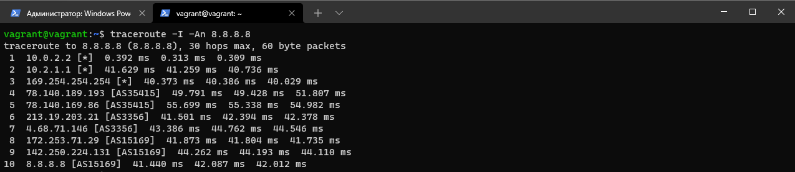
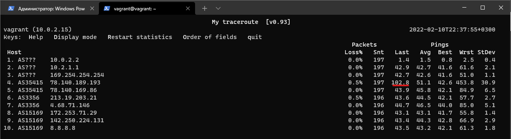

### Домашнее задание к занятию "3.6. Компьютерные сети, лекция 1"

1. Отправим HTTP запрос с помощью telnet
    
    ```bash
    telnet stackoverflow.com 80
    
    GET /questions HTTP/1.0
    HOST: stackoverflow.com
    ```
    Ответ: 
    ```
    HTTP/1.1 301 Moved Permanently 
    ``` 
    Запрошенный ресурс перемещен. 

2. Полученный HTTP код запроса через браузер 
        
         

    * время загрузки страницы, больше всего было затрачено на ожидпние ответа сервера 114.97 мс.   
    
    ##### Time
    

3. IP указан с учетом подключенного `VPN`

    ##### IP
    

4. Узнаем какому провайдеру принадлежит `IP` и какой автономной системе (`AS`) 

    ```bash
    whois -h whois.radb.net 78.140.162.***
    ```
    ##### WEBZILLA / AS35415
    

5. Посмотрим маршрут до `8.8.8.8` с помощью `traceroute` 
    ```bash
    traceroute -An 8.8.8.8
    ```
    
    

6. На момент трассровки утилитой `mtr` наибольшая задержка была на `4` узле  

    

7. Проверим записи типа `A` для `dns.google` c помощью `dig`
    ```bash
    dig dns.google
    
    ;; ANSWER SECTION:
    dns.google.             173     IN      A       8.8.8.8
    dns.google.             173     IN      A       8.8.4.4

8. Проверим обратную запись `PTR` для `8.8.4.4`
    ```bash
    dig -x 8.8.4.4
    
    ;; ANSWER SECTION:
    "4.4.8.8.in-addr.arpa."	86400	IN	PTR	"dns.google."
    
    dig -x 8.8.8.8

    ;; ANSWER SECTION:
    "8.8.8.8.in-addr.arpa."	86400	IN	PTR	"dns.google."
    ```


### Вопросы

1. Работа c HTTP через телнет.
- Подключитесь утилитой телнет к сайту stackoverflow.com
`telnet stackoverflow.com 80`
- отправьте HTTP запрос
```bash
GET /questions HTTP/1.0
HOST: stackoverflow.com
[press enter]
[press enter]
```
- В ответе укажите полученный HTTP код, что он означает?
2. Повторите задание 1 в браузере, используя консоль разработчика F12.
- откройте вкладку `Network`
- отправьте запрос http://stackoverflow.com
- найдите первый ответ HTTP сервера, откройте вкладку `Headers`
- укажите в ответе полученный HTTP код.
- проверьте время загрузки страницы, какой запрос обрабатывался дольше всего?
- приложите скриншот консоли браузера в ответ.
3. Какой IP адрес у вас в интернете?
4. Какому провайдеру принадлежит ваш IP адрес? Какой автономной системе AS? Воспользуйтесь утилитой `whois`
5. Через какие сети проходит пакет, отправленный с вашего компьютера на адрес 8.8.8.8? Через какие AS? Воспользуйтесь утилитой `traceroute`
6. Повторите задание 5 в утилите `mtr`. На каком участке наибольшая задержка - delay?
7. Какие DNS сервера отвечают за доменное имя dns.google? Какие A записи? воспользуйтесь утилитой `dig`
8. Проверьте PTR записи для IP адресов из задания 7. Какое доменное имя привязано к IP? воспользуйтесь утилитой `dig`

