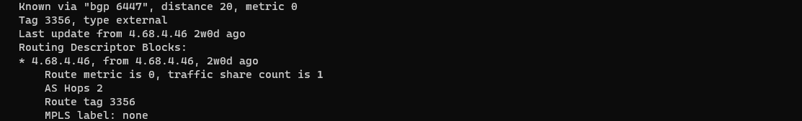
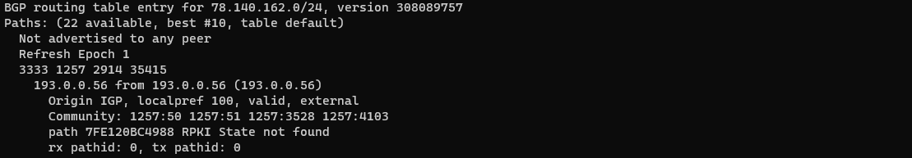
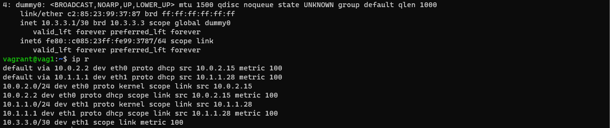
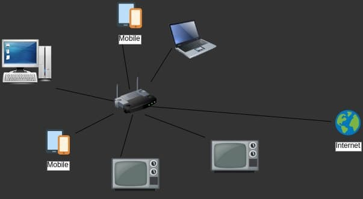

#### Домашнее задание к занятию "3.8. Компьютерные сети, лекция 3"
1. telnet route-views.routeviews.org
   ##### show ip route
   
   ##### show bgp
    


2. Создадим `dummy` интерфейс, создав двай файла в `/etc/systemd/network/`
    ```bash
    sudo nano /etc/systemd/network/dummy0.netdev
    
    [NetDev]
    Name=dummy0
    Kind=dummy

    sudo nano /etc/systemd/network/dummy0.network

    [Match]
    Name=dummy0

    [Network]
    Address=10.3.3.1/30
    ```
    ##### dummy
    

3. Проверим статистику по открытм портам с помощью команды `ss`     
    ```bash
    ss -s
    
    Transport Total     IP        IPv6
    RAW       3         0         3
    UDP       16        10        6
    TCP       19        11        8
    ```
* проверим какие `TCP` порты открты приведем некоторые примеры
    ```bash
    ss -tan

   State           Recv-Q          Send-Q      Port 
   LISTEN          0               4096        53   (DNS)            
   LISTEN          0               128         22   (SSH)
   LISTEN          0               64          2049 (NFS)                    
   ```
4. Проверим какие `udp` сокеты открты 
    ```bash
    ss -uan

   State           Recv-Q          Send-Q      Port 
   ESTAB           0               0           68   (DHCP)
   UNCONN          0               0           53   (DNS)            
   UNCONN          0               0           22   (SSH)
    ```                
5. `L3` диаграмма домашней сети 
    ##### HomeNet
    

#
### Вопросы

# Домашнее задание к занятию "3.8. Компьютерные сети, лекция 3"

1. Подключитесь к публичному маршрутизатору в интернет. Найдите маршрут к вашему публичному IP
```
telnet route-views.routeviews.org
Username: rviews
show ip route x.x.x.x/32
show bgp x.x.x.x/32
```
2. Создайте dummy0 интерфейс в Ubuntu. Добавьте несколько статических маршрутов. Проверьте таблицу маршрутизации.

3. Проверьте открытые TCP порты в Ubuntu, какие протоколы и приложения используют эти порты? Приведите несколько примеров.

4. Проверьте используемые UDP сокеты в Ubuntu, какие протоколы и приложения используют эти порты?

5. Используя diagrams.net, создайте L3 диаграмму вашей домашней сети или любой другой сети, с которой вы работали. 