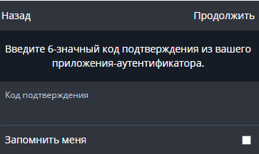
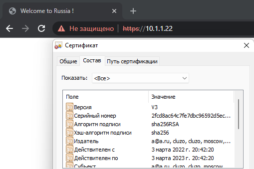
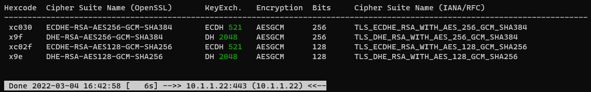
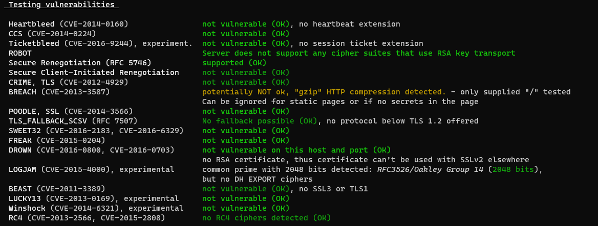

#### Домашнее задание по лекции "Элементы безопасности информационных систем"
1. Устаноил `Bitwarden` для браузера
    
    
2. Включил двухфакторную аутентификацию 

    
3. Настройка Apache2
    
    ```bash
    "Активируем модуль SSL" 
    
    sudo a2enmod ssl    
    ```  
    ```bash
    "Перезапустим службу"
    
    sudo systemctl restart apache2   
    ```
    ```bash
    "Создадим ключ и сертификат"  
    
    sudo openssl req -x509 -nodes -days 365 -newkey rsa:2048 
    -keyout /etc/ssl/private/apache-selfsigned.key 
    -out /etc/ssl/certs/apache-selfsigned.crt  
    ```
    ```bash
    "Создадим конфиг"  
    
    sudo nano /etc/apache2/sites-available/test.conf

    <VirtualHost *:443>
        ServerName test.site
        DocumentRoot /var/www/html
        SSLEngine on
        SSLCertificateFile /etc/ssl/certs/apache-selfsigned.crt
        SSLCertificateKeyFile /etc/ssl/private/apache-selfsigned.key
    # enable HTTP/2, if available
        Protocols h2 http/1.1
    </VirtualHost>
    # intermediate configuration
        SSLProtocol             all -SSLv3 -TLSv1 -TLSv1.1
        SSLCipherSuite          ECDHE-ECDSA-AES128-GCM-SHA256:ECDHE-RSA-AES128-GCM-SHA256:ECDHE-ECDSA-AES256-GCM-SHA384:ECDHE-RSA-AES256-GCM-SHA3>SSLHonorCipherOrder     off
        SSLSessionTickets       off

        SSLUseStapling On
        SSLStaplingCache "shmcb:logs/ssl_stapling(32768)"
    ```   
    ```bash
    "Подключим хост"
    
    sudo a2ensite test.conf
    ```
    ```bash
    "Проверим конфигурацию и перезапустим службу"
    
    sudo apache2ctl configtest
    sudo systemctl reload apache2
    ```
    ##### TLS
    

4. Скачаем скрипт для проверки `tls` настроек web-сервера
    ```bash
    git clone --depth 1 https://github.com/drwetter/testssl.sh.git
    ```
    ```bash
    "Проверим ранее созданный сайт быстрым тестом"
    
    ./testssl.sh -e --fast --parallel https://10.1.1.22
    ```
     ##### Fast test
    
    ```bash
    "Проверим сайт на уязвимости"
    
    ./testssl.sh -U --sneaky --parallel https://10.1.1.22
    ```
    ##### Full test
    

5. После всех манипуляций по настройке `openssh` подключимся по нестандартному порту и нестандартному ключу. 
    ```bash
    ssh -i "~/.ssh/test_ssh" user@78.140.2**.*** -p 1**5
    
    Enter passphrase for key '/home/user/.ssh/test_ssh':***
    ```
6. Добавим `host` в `ssh config`
    ```bash
    sudo nano ~/.ssh/config

    Host test
    HostName 78.140.2**.***
    User user
    port 1**5
    IdentityFile /home/user/.ssh/test_ssh
    IdentitiesOnly yes
    ```    
    ```bash
    "Подключимся по имени"
    ssh test

    Enter passphrase for key '/home/user/.ssh/test_ssh':***
    ```
7. Создадим дамп сетевого трафика с интерфейса `eth1` с помощью `tcpdump`
    ```bash
    sudo tcpdump -w dump.pcap -c 100 -i eth1    
    ```
    ##### wireshark
    

    
     #### Шпаргалка `tcpdump`
    ```bash
    # интерфейс
    tcpdump -i eth0
    # список доступных интерфейсов
    tcpdump -D
    # кол-во пакетов
    tcpdump -c 5 -i eth0    
    # запись в файл
    tcpdump -w 0001.pcap -i eth0
    # чтение из файла
    tcpdump -r 0001.pcap
    # фильтр только TCP port 22
    tcpdump -i eth0 port 22
    # фильтр Source или Destination IP адрес
    tcpdump -i eth0 src 192.168.1.1
    ```

#### Вопросы 

1. Установите Bitwarden плагин для браузера. Зарегестрируйтесь и сохраните несколько паролей.

2. Установите Google authenticator на мобильный телефон. Настройте вход в Bitwarden акаунт через Google authenticator OTP.

3. Установите apache2, сгенерируйте самоподписанный сертификат, настройте тестовый сайт для работы по HTTPS.

4. Проверьте на TLS уязвимости произвольный сайт в интернете (кроме сайтов МВД, ФСБ, МинОбр, НацБанк, РосКосмос, РосАтом, РосНАНО и любых госкомпаний, объектов КИИ, ВПК ... и тому подобное).

5. Установите на Ubuntu ssh сервер, сгенерируйте новый приватный ключ. Скопируйте свой публичный ключ на другой сервер. Подключитесь к серверу по SSH-ключу.
 
6. Переименуйте файлы ключей из задания 5. Настройте файл конфигурации SSH клиента, так чтобы вход на удаленный сервер осуществлялся по имени сервера.

7. Соберите дамп трафика утилитой tcpdump в формате pcap, 100 пакетов. Откройте файл pcap в Wireshark.
