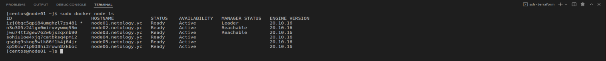
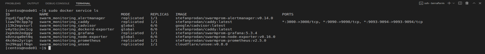
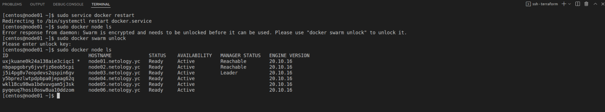

#### Домашнее задание к занятию "5.5. Оркестрация кластером Docker контейнеров на примере Docker Swarm"

##### Задача 1
`1.` В чём отличие режимов работы сервисов в Docker Swarm кластере: replication и global
  |  |  |
   | --- | --- |
   | `global` | Данный тип в docker swarm означает, что сервис будет запущен в одном экземпляре на каждой ноде в кластере. 
   | `replicated` | Данный тип означает, что можно задать n-число реплик микросервиса, которые будут равномерно распределны и запущены на всех доступных нодах.

`2.` Какой алгоритм выбора лидера используется в Docker Swarm кластере?
 |  |  |
   | --- | --- |
   |`Алгоритм консенсуса RAFT`|  Причина, по которой Docker swarm использует алгоритм консенсуса, заключается в том, чтобы убедиться, что все узлы диспетчера, отвечающие за управление и планирование задач в кластере, хранят одно и то же согласованное состояние. 

Наличие одинакового согласованного состояния во всем кластере означает, что в случае сбоя любой узел диспетчера может забрать задачи и восстановить службы в стабильное состояние. Например, если менеджер лидеров, отвечающий за планирование задач в кластере, неожиданно умирает, любой другой менеджер может подобрать задачу планирования и перебалансировать задачи в соответствии с желаемым состоянием.
___

`3.` Что такое Overlay Network?

`Overlay network`- вирутальная сеть, которая создается поверх другой сети. В docker, overlay-сеть создает подсеть, которую могут использовать контейнеры в разных хостах swarm-кластера. Контейнеры на разных физических хостах могут обмениваться данными по overlay-сети (если все они прикреплены к одной сети).


##### Задача 2

Созданный Docker Swarm калстер 
```bash
docker node ls
```



##### Задача 3

Созданный Docker Swarm калстер мониторинга
```bash
docker service ls
```



##### Задача 4
Команда `docker swarm update --autolock=true` влючает функцию автоблокировки docker swarm в случае если служба будет остановлена или перезапущена. При перезапуске Docker в память каждого управляющего узла загружается ключ TLS, используемый для шифрования связи между узлами swarm, так и ключ, используемый для шифрования и расшифровки журналов Raft на диске, тем самым защищая от посторонних лиц. Для разблокировки после перезапуска потребуется в ручном режиме ввести ключ разблокировки, который был получен при инициализации docker swarm.

 ```bash  
[centos@node01 ~]$ sudo docker swarm update --autolock=true
Swarm updated.
To unlock a swarm manager after it restarts, run the `docker swarm unlock`
command and provide the following key:

    SWMKEY-1-************

Please remember to store this key in a password manager, since without it you
will not be able to restart the manager. 
```


<details>
<summary>Задания</summary>

# Домашнее задание к занятию "5.5. Оркестрация кластером Docker контейнеров на примере Docker Swarm"

## Задача 1

Дайте письменые ответы на следующие вопросы:

- В чём отличие режимов работы сервисов в Docker Swarm кластере: replication и global?
- Какой алгоритм выбора лидера используется в Docker Swarm кластере?
- Что такое Overlay Network?

## Задача 2

Создать ваш первый Docker Swarm кластер в Яндекс.Облаке

Для получения зачета, вам необходимо предоставить скриншот из терминала (консоли), с выводом команды:
```
docker node ls
```

## Задача 3

Создать ваш первый, готовый к боевой эксплуатации кластер мониторинга, состоящий из стека микросервисов.

Для получения зачета, вам необходимо предоставить скриншот из терминала (консоли), с выводом команды:
```
docker service ls
```

## Задача 4 (*)

Выполнить на лидере Docker Swarm кластера команду (указанную ниже) и дать письменное описание её функционала, что она делает и зачем она нужна:
```
# см.документацию: https://docs.docker.com/engine/swarm/swarm_manager_locking/
docker swarm update --autolock=true
```


---

### Как cдавать задание

Выполненное домашнее задание пришлите ссылкой на .md-файл в вашем репозитории.

---