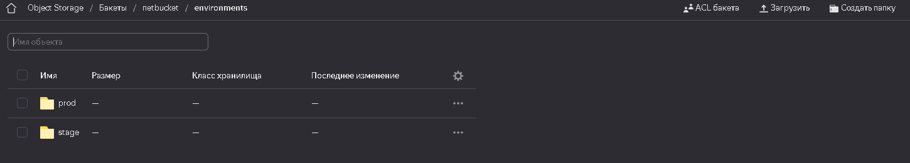
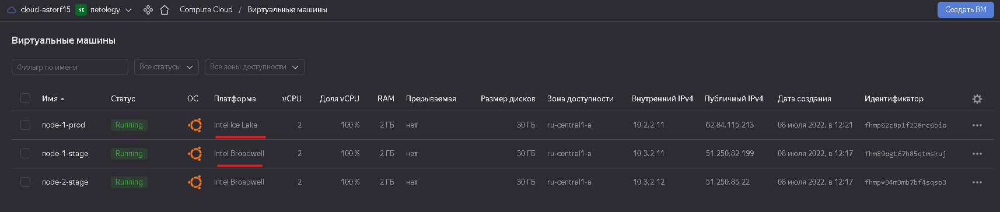
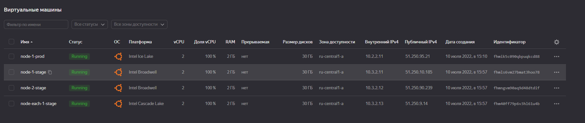

### Домашнее задание к занятию "7.3. Основы и принцип работы Терраформ"

#### Задача 1
Создадим аккаунт `yc`, bucket и зарегистрируем backend
```h

terraform {
  backend "s3" {
    endpoint             = "storage.yandexcloud.net"
    bucket               = "netbucket"
    region               = "ru-central1"
    workspace_key_prefix = "environments"
    key                  = "terraform.tfstate"
    access_key           = "***"
    secret_key           = "***"

    skip_region_validation      = true
    skip_credentials_validation = true
  }
}
```
#### Задача 2. 
Создадим 2 папки под разные среды `stage` и `prod`, инициализируем проект и создадим для них воркспейсы.

```bash
terraform init

# create workspaces
terraform workspace new stage
terraform workspace new prod

# workspaces list
terraform workspace list
  default
* prod
  stage
```

Проверим записанные стейты в бакет




Создадим 2 инстанса для среды `stage` используя в конфигруации `count`

Stage instance type - `standard-v3`

```h
# yc compute instance stage

resource "yandex_compute_instance" "node" {
  count    = 2
  zone     = "ru-central1-a"
  name     = "node-${count.index + 1}-${terraform.workspace}"
  hostname = "node-${count.index + 1}.netology.${terraform.workspace}"
  platform_id = "standard-v3"
  allow_stopping_for_update = true
  
  resources {
    cores  = 2
    memory = 2
  }

  boot_disk {
    initialize_params {
      image_id = var.ubuntu_20
      name     = "root-prod-${count.index + 1}"
      type     = "network-nvme"
      size     = "30"
    }
  }

  network_interface {
    subnet_id  = yandex_vpc_subnet.default.id
    nat        = true
    ip_address = "10.2.2.1${count.index + 1}"
  }

  metadata = {
    ssh-keys = "ubuntu:${file("~/.ssh/id_rsa.pub")}"
  }
}
```

Создадим по той же схеме 1 инстанс для среды `prod`, но изменим тип инстанса параметром `platform_id = "standard-v1"`




Добавим к ранее созданным виртуальным машинам в среде `stage` еще один инстанс, но создадим его с помощью `for_each`

```h
# yc count instance
resource "yandex_compute_instance" "node" {
 count    = 2
 zone     = "ru-central1-a"
 name     = "node-${count.index + 1}-stage"
 hostname = "node-${count.index + 1}.netology.${terraform.workspace}"
 platform_id = "standard-v1"
 allow_stopping_for_update = true
 resources {
  cores  = 2
  memory = 2
 }
 
 boot_disk {
    initialize_params {
      image_id = var.ubuntu_20
      name     = "root-${terraform.workspace}-${count.index + 1}"
      type     = "network-nvme"
      size     = "30"
    }
  }

  network_interface {
    subnet_id  = yandex_vpc_subnet.default.id
    nat        = true
    ip_address = "10.3.2.1${count.index + 1}"
  }

  metadata = {
    ssh-keys = "ubuntu:${file("~/.ssh/id_rsa.pub")}"
  }
}

// yc for each instance
locals {
  id = toset([
    "1",
  ])
}

resource "yandex_compute_instance" "each" {
  for_each    = local.id
  name        = "node-each-${each.key}-${terraform.workspace}"
  zone        = "ru-central1-a"
  platform_id = "standard-v2"
  resources {
    cores  = "2"
    memory = "2"
  }

  boot_disk {
    initialize_params {
      image_id = var.ubuntu_20
      name     = "root-${terraform.workspace}-each-${each.key}"
      type     = "network-nvme"
      size     = "30"
    }
  }

  network_interface {
    subnet_id  = yandex_vpc_subnet.default.id
    nat        = true
    ip_address = "10.3.2.1${each.key+2}"
  }
  metadata = {
    ssh-keys = "ubuntu:${file("~/.ssh/id_rsa.pub")}"
  }
}
```



```bash
terraform plan -no-color > stage_plan.txt
```

<details>
<summary>terraform plan `stage`</summary>

```bash
Terraform used the selected providers to generate the following execution plan. Resource actions are indicated with the following symbols:
  + create

Terraform will perform the following actions:

  # yandex_compute_instance.each["1"] will be created
  + resource "yandex_compute_instance" "each" {
      + created_at                = (known after apply)
      + folder_id                 = (known after apply)
      + fqdn                      = (known after apply)
      + hostname                  = (known after apply)
      + id                        = (known after apply)
      + metadata                  = {
          + "ssh-keys" = <<-EOT
                ubuntu:ssh-rsa AAAAB3NzaC1yc2EAAAADAQABAAABgQDuZqkdk1e5Y0Cid47tkBqvDOz4tqGqc5clrgzA2tfrPvbkXv6k36Xm5r6V6ZQ9TpZ0YFSpnv9RoptAxV+5t67sltz+r+LY6zTSRl8cRn0bYU5Mlo//7OIqm9TG1dS+cizk+aCxQlTasQt2J90PgKxThAmitGGdgpYKiFHlRujAZWXYs2kibZ4RDGreEMC4wUS6dAFknanITwjpZqauOn0ieLhQf7/YwJEV+iZnMb7j5m81djBs8xEAlZwWNt4FlxJoZxycM/zVw7Iq0ie7Gm+OyfkLDxe4VldqdSdlhEBRME5owwUc83tQczyJDji2owZvylJf+ZHpgQ91AEkMyysWvj2ryz/yi1cLtJwCOOYu9rviQIZXDBOUqaLevhHRTCaKswXv5EjOx7zATuKxasob0QzOUI4sqB81dWN2RTAlnZZE2TIbmRO9247ylFSBKkve87gmYmEee3WZ670p4ZcxNQlrrCYWkb5B7FXjJPfn+RVrIYe2nMYARa+wG5nNNjM= astorf@ubuntu
            EOT
        }
      + name                      = "node-each-1-stage"
      + network_acceleration_type = "standard"
      + platform_id               = "standard-v2"
      + service_account_id        = (known after apply)
      + status                    = (known after apply)
      + zone                      = "ru-central1-a"

      + boot_disk {
          + auto_delete = true
          + device_name = (known after apply)
          + disk_id     = (known after apply)
          + mode        = (known after apply)

          + initialize_params {
              + block_size  = (known after apply)
              + description = (known after apply)
              + image_id    = "fd8db2s90v5knmg1p7dv"
              + name        = "root-stage-each-1"
              + size        = 30
              + snapshot_id = (known after apply)
              + type        = "network-nvme"
            }
        }

      + network_interface {
          + index              = (known after apply)
          + ip_address         = "10.3.2.13"
          + ipv4               = true
          + ipv6               = (known after apply)
          + ipv6_address       = (known after apply)
          + mac_address        = (known after apply)
          + nat                = true
          + nat_ip_address     = (known after apply)
          + nat_ip_version     = (known after apply)
          + security_group_ids = (known after apply)
          + subnet_id          = (known after apply)
        }

      + placement_policy {
          + host_affinity_rules = (known after apply)
          + placement_group_id  = (known after apply)
        }

      + resources {
          + core_fraction = 100
          + cores         = 2
          + memory        = 2
        }

      + scheduling_policy {
          + preemptible = (known after apply)
        }
    }

  # yandex_compute_instance.node[0] will be created
  + resource "yandex_compute_instance" "node" {
      + allow_stopping_for_update = true
      + created_at                = (known after apply)
      + folder_id                 = (known after apply)
      + fqdn                      = (known after apply)
      + hostname                  = "node-1.netology.stage"
      + id                        = (known after apply)
      + metadata                  = {
          + "ssh-keys" = <<-EOT
                ubuntu:ssh-rsa AAAAB3NzaC1yc2EAAAADAQABAAABgQDuZqkdk1e5Y0Cid47tkBqvDOz4tqGqc5clrgzA2tfrPvbkXv6k36Xm5r6V6ZQ9TpZ0YFSpnv9RoptAxV+5t67sltz+r+LY6zTSRl8cRn0bYU5Mlo//7OIqm9TG1dS+cizk+aCxQlTasQt2J90PgKxThAmitGGdgpYKiFHlRujAZWXYs2kibZ4RDGreEMC4wUS6dAFknanITwjpZqauOn0ieLhQf7/YwJEV+iZnMb7j5m81djBs8xEAlZwWNt4FlxJoZxycM/zVw7Iq0ie7Gm+OyfkLDxe4VldqdSdlhEBRME5owwUc83tQczyJDji2owZvylJf+ZHpgQ91AEkMyysWvj2ryz/yi1cLtJwCOOYu9rviQIZXDBOUqaLevhHRTCaKswXv5EjOx7zATuKxasob0QzOUI4sqB81dWN2RTAlnZZE2TIbmRO9247ylFSBKkve87gmYmEee3WZ670p4ZcxNQlrrCYWkb5B7FXjJPfn+RVrIYe2nMYARa+wG5nNNjM= astorf@ubuntu
            EOT
        }
      + name                      = "node-1-stage"
      + network_acceleration_type = "standard"
      + platform_id               = "standard-v1"
      + service_account_id        = (known after apply)
      + status                    = (known after apply)
      + zone                      = "ru-central1-a"

      + boot_disk {
          + auto_delete = true
          + device_name = (known after apply)
          + disk_id     = (known after apply)
          + mode        = (known after apply)

          + initialize_params {
              + block_size  = (known after apply)
              + description = (known after apply)
              + image_id    = "fd8db2s90v5knmg1p7dv"
              + name        = "root-stage-1"
              + size        = 30
              + snapshot_id = (known after apply)
              + type        = "network-nvme"
            }
        }

      + network_interface {
          + index              = (known after apply)
          + ip_address         = "10.3.2.11"
          + ipv4               = true
          + ipv6               = (known after apply)
          + ipv6_address       = (known after apply)
          + mac_address        = (known after apply)
          + nat                = true
          + nat_ip_address     = (known after apply)
          + nat_ip_version     = (known after apply)
          + security_group_ids = (known after apply)
          + subnet_id          = (known after apply)
        }

      + placement_policy {
          + host_affinity_rules = (known after apply)
          + placement_group_id  = (known after apply)
        }

      + resources {
          + core_fraction = 100
          + cores         = 2
          + memory        = 2
        }

      + scheduling_policy {
          + preemptible = (known after apply)
        }
    }

  # yandex_compute_instance.node[1] will be created
  + resource "yandex_compute_instance" "node" {
      + allow_stopping_for_update = true
      + created_at                = (known after apply)
      + folder_id                 = (known after apply)
      + fqdn                      = (known after apply)
      + hostname                  = "node-2.netology.stage"
      + id                        = (known after apply)
      + metadata                  = {
          + "ssh-keys" = <<-EOT
                ubuntu:ssh-rsa AAAAB3NzaC1yc2EAAAADAQABAAABgQDuZqkdk1e5Y0Cid47tkBqvDOz4tqGqc5clrgzA2tfrPvbkXv6k36Xm5r6V6ZQ9TpZ0YFSpnv9RoptAxV+5t67sltz+r+LY6zTSRl8cRn0bYU5Mlo//7OIqm9TG1dS+cizk+aCxQlTasQt2J90PgKxThAmitGGdgpYKiFHlRujAZWXYs2kibZ4RDGreEMC4wUS6dAFknanITwjpZqauOn0ieLhQf7/YwJEV+iZnMb7j5m81djBs8xEAlZwWNt4FlxJoZxycM/zVw7Iq0ie7Gm+OyfkLDxe4VldqdSdlhEBRME5owwUc83tQczyJDji2owZvylJf+ZHpgQ91AEkMyysWvj2ryz/yi1cLtJwCOOYu9rviQIZXDBOUqaLevhHRTCaKswXv5EjOx7zATuKxasob0QzOUI4sqB81dWN2RTAlnZZE2TIbmRO9247ylFSBKkve87gmYmEee3WZ670p4ZcxNQlrrCYWkb5B7FXjJPfn+RVrIYe2nMYARa+wG5nNNjM= astorf@ubuntu
            EOT
        }
      + name                      = "node-2-stage"
      + network_acceleration_type = "standard"
      + platform_id               = "standard-v1"
      + service_account_id        = (known after apply)
      + status                    = (known after apply)
      + zone                      = "ru-central1-a"

      + boot_disk {
          + auto_delete = true
          + device_name = (known after apply)
          + disk_id     = (known after apply)
          + mode        = (known after apply)

          + initialize_params {
              + block_size  = (known after apply)
              + description = (known after apply)
              + image_id    = "fd8db2s90v5knmg1p7dv"
              + name        = "root-stage-2"
              + size        = 30
              + snapshot_id = (known after apply)
              + type        = "network-nvme"
            }
        }

      + network_interface {
          + index              = (known after apply)
          + ip_address         = "10.3.2.12"
          + ipv4               = true
          + ipv6               = (known after apply)
          + ipv6_address       = (known after apply)
          + mac_address        = (known after apply)
          + nat                = true
          + nat_ip_address     = (known after apply)
          + nat_ip_version     = (known after apply)
          + security_group_ids = (known after apply)
          + subnet_id          = (known after apply)
        }

      + placement_policy {
          + host_affinity_rules = (known after apply)
          + placement_group_id  = (known after apply)
        }

      + resources {
          + core_fraction = 100
          + cores         = 2
          + memory        = 2
        }

      + scheduling_policy {
          + preemptible = (known after apply)
        }
    }

  # yandex_vpc_network.default will be created
  + resource "yandex_vpc_network" "default" {
      + created_at                = (known after apply)
      + default_security_group_id = (known after apply)
      + folder_id                 = (known after apply)
      + id                        = (known after apply)
      + labels                    = (known after apply)
      + name                      = "net_stage"
      + subnet_ids                = (known after apply)
    }

  # yandex_vpc_subnet.default will be created
  + resource "yandex_vpc_subnet" "default" {
      + created_at     = (known after apply)
      + folder_id      = (known after apply)
      + id             = (known after apply)
      + labels         = (known after apply)
      + name           = "subnet2"
      + network_id     = (known after apply)
      + v4_cidr_blocks = [
          + "10.3.2.0/24",
        ]
      + v6_cidr_blocks = (known after apply)
      + zone           = "ru-central1-a"
    }

Plan: 5 to add, 0 to change, 0 to destroy.
```
</details>

<details>
<summary>Задания</summary>
# Домашнее задание к занятию "7.3. Основы и принцип работы Терраформ"

## Задача 1. Создадим бэкэнд в S3 (необязательно, но крайне желательно).

Если в рамках предыдущего задания у вас уже есть аккаунт AWS, то давайте продолжим знакомство со взаимодействием
терраформа и aws. 

1. Создайте s3 бакет, iam роль и пользователя от которого будет работать терраформ. Можно создать отдельного пользователя,
а можно использовать созданного в рамках предыдущего задания, просто добавьте ему необходимы права, как описано 
[здесь](https://www.terraform.io/docs/backends/types/s3.html).
1. Зарегистрируйте бэкэнд в терраформ проекте как описано по ссылке выше. 


## Задача 2. Инициализируем проект и создаем воркспейсы. 

1. Выполните `terraform init`:
    * если был создан бэкэнд в S3, то терраформ создат файл стейтов в S3 и запись в таблице 
dynamodb.
    * иначе будет создан локальный файл со стейтами.  
1. Создайте два воркспейса `stage` и `prod`.
1. В уже созданный `aws_instance` добавьте зависимость типа инстанса от вокспейса, что бы в разных ворскспейсах 
использовались разные `instance_type`.
1. Добавим `count`. Для `stage` должен создаться один экземпляр `ec2`, а для `prod` два. 
1. Создайте рядом еще один `aws_instance`, но теперь определите их количество при помощи `for_each`, а не `count`.
1. Что бы при изменении типа инстанса не возникло ситуации, когда не будет ни одного инстанса добавьте параметр
жизненного цикла `create_before_destroy = true` в один из рессурсов `aws_instance`.
1. При желании поэкспериментируйте с другими параметрами и рессурсами.

В виде результата работы пришлите:
* Вывод команды `terraform workspace list`.
* Вывод команды `terraform plan` для воркспейса `prod`.  

---

### Как cдавать задание

Выполненное домашнее задание пришлите ссылкой на .md-файл в вашем репозитории.
