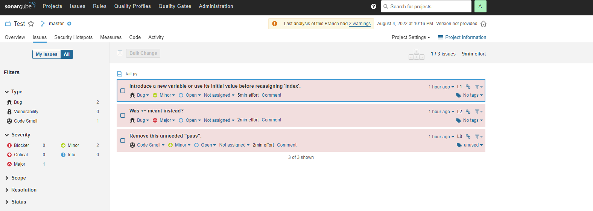
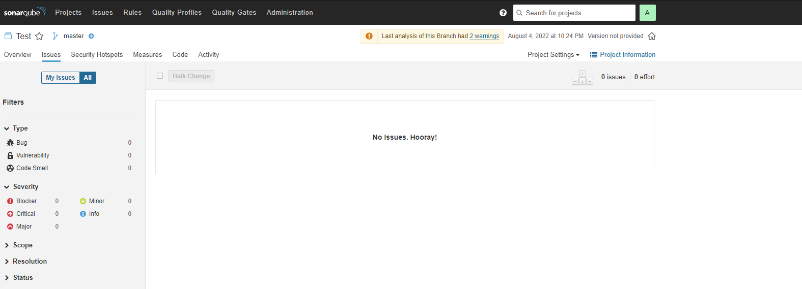
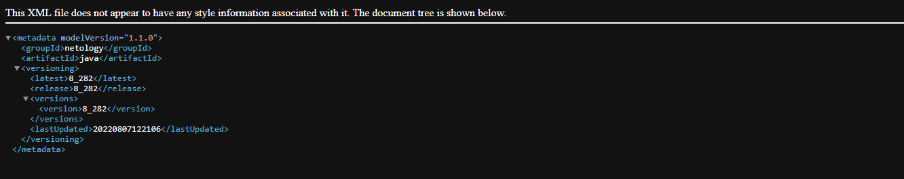

### Домашнее задание к занятию "09.02 CI\CD"

#### `SonarQube`

Развернем контейнеры с `SonarQube` и `Postgres` с помощью `Docker`

```yml
version: "3"

services:
  sonarqube:
    image: sonarqube:community
    depends_on:
      - db
    environment:
      SONAR_JDBC_URL: jdbc:postgresql://db:5432/sonar
      SONAR_JDBC_USERNAME: sonar
      SONAR_JDBC_PASSWORD: sonar
    volumes:
      - sonarqube_data:/opt/sonarqube/data
      - sonarqube_extensions:/opt/sonarqube/extensions
      - sonarqube_logs:/opt/sonarqube/logs
    ports:
      - "9000:9000"
  db:
    image: postgres:12
    environment:
      POSTGRES_USER: sonar
      POSTGRES_PASSWORD: sonar
    volumes:
      - postgresql:/var/lib/postgresql
      - postgresql_data:/var/lib/postgresql/data

volumes:
  sonarqube_data:
  sonarqube_extensions:
  sonarqube_logs:
  postgresql:
  postgresql_data:
```

Установим `sonar-scanner` 

```bash
wget https://binaries.sonarsource.com/Distribution/sonar-scanner-cli/sonar-scanner-cli-4.7.0.2747-linux.zip

unzip -d /opt/sonar-scanner/ sonar-scanner-cli-4.7.0.2747-linux.zip

# пропишем путь в .bashrc
export PATH="/opt/sonar-scanner/bin:$PATH"
```

Протестирем `file.py` в локальном репозитории 

```bash
sonar-scanner \
-Dsonar.projectKey=Test \
-Dsonar.sources=. \
-Dsonar.host.url=http://10.3.1.128:9000 \
-Dsonar.login=sqp_319eef438fcd8692b13a4d638a80d16eefd987b4 \
-Dsonar.coverage.exclusions=fail.py
```


Исправим ошибки и запустим тест еще раз



#### `Nexus`

Развернем контейнер с `Nexus` с помощью `Docker`

```yml
version: "3"
services:
  nexus:
    image: sonatype/nexus3
    container_name: nexus3
    volumes:
      - "nexus-data:/nexus-data"
    ports:
      - "8081:8081"
volumes:
  nexus-data: {}
```

В репозиторий `maven-public` загрузим артефакт с GAV параметрами и получим файл `maven-metadata.xml`



* [maven-metadata](https://github.com/astorf15/net.devops/blob/main/homework/9.2-ci-cicd/mvn/maven-metadata.xml)


#### `Maven`

Установим `Maven` добавим зависимотси в `pom.xml` и запустим сборку

```bash 
mvn package

[INFO] Building jar: /mnt/win/Documents/Netology.DevOps/net.devops/homework/9.2-ci-cicd/mvn/target/java-8_282.jar
[INFO] ------------------------------------------------------------------------
[INFO] BUILD SUCCESS
[INFO] ------------------------------------------------------------------------
[INFO] Total time:  23.280 s
[INFO] Finished at: 2022-08-07T18:56:06+03:00
[INFO] ------------------------------------------------------------------------
```
* [maven-pom](https://github.com/astorf15/net.devops/blob/main/homework/9.2-ci-cicd/mvn/pom.xml)

