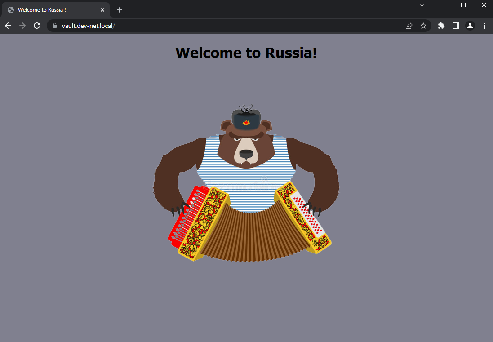

#### Курсовая работа по итогам модуля "DevOps и системное администрирование"
1. Создадим виртуальную машину с помощью Vagrant
2. Добавим правила `iptables`
   ```bash   
   sudo iptables -A INPUT -i lo -j ACCEPT
   sudo iptables -A INPUT -p tcp --dport 22 -j ACCEPT
   sudo iptables -A INPUT -p tcp --dport 443 -j ACCEPT
   sudo iptables -A INPUT -m state --state ESTABLISHED,RELATED -j ACCEPT
   sudo iptables -P INPUT DROP
   
   sudo netfilter-persistent save
   ...

3. Установим и настроим Vault 
   ```bash
   curl -fsSL https://apt.releases.hashicorp.com/gpg | sudo apt-key add -
   sudo apt-add-repository "deb [arch=amd64] https://apt.releases.hashicorp.com $(lsb_release -cs) main"
   sudo apt-get update && sudo apt-get install vault
   # Разрешим vault работу по `HTTP` раскомментировав строчки под HTTP listener так же сменим порт
   sudo nano/etc/vault.d/vault.hcl
   
   # Добавим в переменную окружения адрес с `HTTP` 
   sudo nano/etc/enviroment
   VAULT_ADDR=http://127.0.0.1:8201
   # Перезапутим службу
   sudo systemctl restart vault
   # Проверим статус
   vault status 
   
   # Инициализируем и распечатаем сервер
   vault operator init
   # Введем 3 раза полученные ранее 'Unseal Key'
   vault operator unseal
   # Создадим новый token для управления, сроком на 1 год
   vault token create -ttl 720h
   # 
   ```
4. Создадим ЦС и выпустим ключи для `nginx`  
   ```bash
   # Активируем PKI
   vault secrets enable pki 
   
   # Установим срок работы ЦС `PKI`
   vault secrets tune -max-lease-ttl=1400h pki 
   
   # Создадим корневой сертификат и сохраним в формате CA_cert.crt
   vault write -field=certificate pki/root/generate/internal \ common_name="CA.local" \ ttl=1400h > CA_cert.crt
  
   # Публикуем URL-адреса CA и CRL.
   vault write pki/config/urls \
    issuing_certificates="http://127.0.0.1:8201/v1/pki/ca" \
    crl_distribution_points="http://127.0.0.1:8201/v1/pki/crl"
   
   # Настроим промежуточный ЦС 
   vault secrets enable -path=pki_int pki 
   
   # Установим срок работы промежуточного ЦС `PKI`
   vault secrets tune -max-lease-ttl=1400h pki_int 
   
   # Сгенерируем промежуточный файл и сохраним CSR как файл `pki_int.csr`
   vault write -format=json pki_int/intermediate/generate/internal \ common_name="CA_INT.local Intermediate Authority" | jq -r '.data.csr' > pki_int.csr
   
   # Подпишем промежуточный сертификат закрытым ключом корневого ЦС    
   vault write -format=json pki/root/sign-intermediate csr=@pki_int.csr \ format=pem_bundle ttl="1400h" | jq -r '.data.certificate' > intermediate.cert.pem    
   
   # Импортируем сертификат обратно в `Vault`
   vault write pki_int/intermediate/set-signed certificate=@intermediate.cert.pem

   # Публикуем URL-адреса для промежуточного CA
   vault write pki/config/urls \
    issuing_certificates="http://127.0.0.1:8201/v1/pki_int/ca" \
    crl_distribution_points="http://127.0.0.1:8201/v1/pki_int/crl"
 
   # Создаем роль, с помощью которой будем выдавать сертификаты для серверов
   vault write pki_int/roles/dev-net-server \
    country="Russia Federation" \
     locality="Moscow" \
   street_address="street-1" \
   postal_code="115533" \
   organization="Gipertech" \
   ou="IT" \
   allowed_domains="dev-net.local" \
   allow_subdomains=true \
   max_ttl="87600h" \
   key_bits="2048" \
   key_type="rsa" \
   allow_any_name=false \
   allow_bare_domains=false \
   allow_glob_domain=false \
   allow_ip_sans=true \
   allow_localhost=false \
   client_flag=false \
   server_flag=true \
   enforce_hostnames=true \
   key_usage="DigitalSignature,KeyEncipherment" \
   ext_key_usage="ServerAuth" \
   require_cn=true
   
   # Сгенерируем сертификат сроком на 1 месяц   
   vault write -format=json pki_int/issue/dev-net-server \
    common_name="vault.dev-net.local" \
    alt_names="vault.dev-net.local" \
    ttl="720h" > dev-net.local.crt
   
   # Сохраним сертификат в нужном формате
   cat dev-net.local.crt | jq -r .data.certificate > dev-net.local.pem
   cat dev-net.local.crt | jq -r .data.issuing_ca >> dev-net.local.pem
   cat dev-net.local.crt | jq -r .data.private_key > dev-net.local.key 
   ```
5. Установим CA в доверенные
6. Установим `Nginx`
   ```bash
   sudo apt install nginx -y
   
   # Добавим в автозагрузку
   sudo systemctl enable nginx
   ```
7. Настроим `nginx`
   ```bash
   # Создадим конфиг для нашего сайта
   sudo nano /etc/nginx/sites-available/dev-net
   
   # Config
   server {
    listen 80;
    listen [::]:80;
    root /var/www/html;
    index dev-net.html;
    location / {
        return 301 https://vault.dev-net.local$request_uri;
    }
   }
   server {
    listen 443 ssl http2;
    listen [::]:443 ssl http2;
    server_name vault.dev-net.local;
    resolver 127.0.0.1;
    root /var/www/html;
    index dev-net.html;

    ssl_stapling on;
    ssl on;
    ssl_certificate /etc/nginx/ssl/dev-net.local.pem;
    ssl_certificate_key /etc/nginx/ssl/dev-net.local.key;
    ssl_session_timeout 24h;
    ssl_session_cache shared:SSL:2m;
    ssl_protocols TLSv1 TLSv1.1 TLSv1.2;
    ssl_ciphers kEECDH+AES128:kEECDH:kEDH:-3DES:kRSA+AES128:kEDH+3DES:DES-CBC3-SHA:!RC4:!aNULL:!eNULL:!MD5:!EXPORT:!LOW:!SEED:!CAMELLIA:!IDEA:!PSK:!SRP:!SSLv2;
    ssl_prefer_server_ciphers on;
    add_header Strict-Transport-Security "max-age=31536000;";
    add_header Content-Security-Policy-Report-Only "default-src https:; script-src https: 'unsafe-eval' 'unsafe-inline'; style-src https: 'unsafe-inline'; img-src https: data:; font-src https: data:; report-uri /csp-report";
   }
   ```
8. Откроем созданную страницу `https://vault.dev-net.local`
   
   

9. Создадим скрипт, который будет генерировать новый сертификат в vault раз в месяц
   ```bash
   #!/bin/bash

   # Обозначим переменные
   read login < /home/vagrant/scripts/k1.txt
   key=/home/vagrant/scripts/k2.txt
   ssl_dir=/etc/nginx/ssl

   # Перейдем в папку в которую будет сформирован сертификат
   cd  /home/vagrant/scripts &&
   
   # Распечатем Vault c помощью 3 ключей из файла
   for h in $(cat $key)
       do
           vault operator unseal $h &> /dev/null
           sleep 1
   done &&
   
   # Авторизуемся в Vault
   vault login $login &> /dev/null &&
   
   # Сгенерируем сертификат сроком на 1 месяц
   vault write -format=json pki_int/issue/dev-net-server \
       common_name="vault.dev-net.local" \
       alt_names="vault.dev-net.local" \
       ttl="720h" > dev-net.local.crt &&
   
   # Сохраним сертификат в нужном формате
   cat dev-net.local.crt | jq -r .data.certificate > dev-net.local.pem &&
   cat dev-net.local.crt | jq -r .data.issuing_ca >> dev-net.local.pem &&
   cat dev-net.local.crt | jq -r .data.private_key > dev-net.local.key &&
   
   # Переместим файлы в дирректорию с ключами
   mv -f dev-net.local.pem dev-net.local.key $ssl_dir &&
   
   # Перезапустим nginx и запечатаем Vault
   systemctl restart nginx  &&
   vault operator seal &&
   
   echo "Смена ключей произведена"
   ```
10. Добавим выполнение скрипта в `crontab`
   ```bash
   sudo crontab -u root -e
   
   # Добавим строчку 
   0 6 28 * * /home/vagrant/scripts/vault.sh
   ```

____
#### Курсовая работа по итогам модуля "DevOps и системное администрирование"

Курсовая работа необходима для проверки практических навыков, полученных в ходе прохождения курса "DevOps и системное администрирование".

Мы создадим и настроим виртуальное рабочее место. Позже вы сможете использовать эту систему для выполнения домашних заданий по курсу

##### Задание

1. Создайте виртуальную машину Linux.
2. Установите ufw и разрешите к этой машине сессии на порты 22 и 443, при этом трафик на интерфейсе localhost (lo) должен ходить свободно на все порты.
3. Установите hashicorp vault ([инструкция по ссылке](https://learn.hashicorp.com/tutorials/vault/getting-started-install?in=vault/getting-started#install-vault)).
4. Cоздайте центр сертификации по инструкции ([ссылка](https://learn.hashicorp.com/tutorials/vault/pki-engine?in=vault/secrets-management)) и выпустите сертификат для использования его в настройке веб-сервера nginx (срок жизни сертификата - месяц).
5. Установите корневой сертификат созданного центра сертификации в доверенные в хостовой системе.
6. Установите nginx.
7. По инструкции ([ссылка](https://nginx.org/en/docs/http/configuring_https_servers.html)) настройте nginx на https, используя ранее подготовленный сертификат:
  - можно использовать стандартную стартовую страницу nginx для демонстрации работы сервера;
  - можно использовать и другой html файл, сделанный вами;
8. Откройте в браузере на хосте https адрес страницы, которую обслуживает сервер nginx.
9. Создайте скрипт, который будет генерировать новый сертификат в vault:
  - генерируем новый сертификат так, чтобы не переписывать конфиг nginx;
  - перезапускаем nginx для применения нового сертификата.
10. Поместите скрипт в crontab, чтобы сертификат обновлялся какого-то числа каждого месяца в удобное для вас время.