# Дипломный практикум по курсу DevOps-инженер в YandexCloud

## Диаграмма инфраструктуры

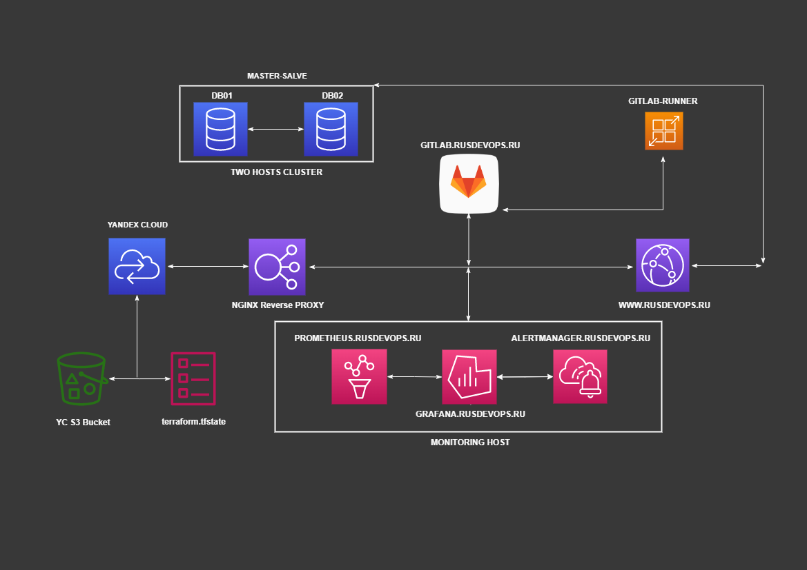

<details>tree<summary>Файловая структура проекта</summary> 

```bash
.
├── img
├── Netology_diplom_project.md
└── stack
    ├── ansible
    │   ├── deploy-stack.yml
    │   ├── inventory
    │   └── roles
    │       ├── apt-update
    │       │   └── tasks
    │       │       └── main.yml
    │       ├── configure-hosts-file
    │       │   └── tasks
    │       │       └── main.yml
    │       ├── configure-ssh
    │       │   ├── handlers
    │       │   │   └── main.yml
    │       │   ├── tasks
    │       │   │   └── main.yml
    │       │   └── templates
    │       │       └── sshd_config.j2
    │       ├── install-app
    │       │   ├── files
    │       │   │   └── docker-compose-app.yml
    │       │   └── tasks
    │       │       └── main.yml
    │       ├── install-docker
    │       │   └── tasks
    │       │       └── main.yml
    │       ├── install-gitlab
    │       │   ├── defaults
    │       │   │   └── main.yml
    │       │   ├── files
    │       │   │   └── gitlab_add_repo.sh
    │       │   ├── handlers
    │       │   │   └── main.yml
    │       │   ├── tasks
    │       │   │   └── main.yml
    │       │   ├── templates
    │       │   │   └── gitlab.rb.j2
    │       │   └── vars
    │       │       └── Debian.yml
    │       ├── install-monitoring
    │       │   ├── files
    │       │   │   ├── alertmanager
    │       │   │   │   └── config.yml
    │       │   │   ├── docker-compose-monitoring.yml
    │       │   │   ├── grafana
    │       │   │   │   ├── dashboards
    │       │   │   │   │   └── Node_exporter_dashboard.json
    │       │   │   │   └── provisioning
    │       │   │   │       ├── dashboards
    │       │   │   │       │   └── dashboards.yml
    │       │   │   │       └── datasources
    │       │   │   │           └── prometheus.yml
    │       │   │   └── prometheus
    │       │   │       ├── alert.rules
    │       │   │       └── prometheus.yml
    │       │   └── tasks
    │       │       └── main.yml
    │       ├── install-mysql-db01
    │       │   ├── files
    │       │   │   ├── docker-compose-mysql.yml
    │       │   │   ├── master.cnf
    │       │   │   └── master.sql
    │       │   └── tasks
    │       │       └── main.yml
    │       ├── install-mysql-db02
    │       │   ├── files
    │       │   │   ├── docker-compose-mysql.yml
    │       │   │   ├── slave.cnf
    │       │   │   └── slave.sql
    │       │   └── tasks
    │       │       └── main.yml
    │       ├── install-node-exporter
    │       │   ├── files
    │       │   │   └── docker-compose-exporter.yml
    │       │   └── tasks
    │       │       └── main.yml
    │       ├── install-proxy
    │       │   ├── defaults
    │       │   │   └── main.yml
    │       │   ├── files
    │       │   │   ├── conf.d
    │       │   │   │   ├── alertmanager.rusdevops.ru.conf
    │       │   │   │   ├── custom-nginx
    │       │   │   │   ├── gitlab.rusdevops.ru.conf
    │       │   │   │   ├── grafana.rusdevops.ru.conf
    │       │   │   │   ├── prometheus.rusdevops.ru.conf
    │       │   │   │   └── rusdevops.ru.conf
    │       │   │   ├── snippets
    │       │   │   │   ├── proxy.conf
    │       │   │   │   └── ssl.conf
    │       │   │   └── ssl
    │       │   │       └── dhparams4096.pem
    │       │   ├── handlers
    │       │   │   └── main.yml
    │       │   └── tasks
    │       │       ├── certbot-install-snap.yml
    │       │       ├── main.yml
    │       │       └── renew-cron.yml
    │       ├── install-runner
    │       │   ├── files
    │       │   │   └── docker-compose-runner.yml
    │       │   └── tasks
    │       │       └── main.yml
    │       ├── install-tools
    │       │   └── tasks
    │       │       └── main.yml
    │       └── iptables-rules
    │           ├── handlers
    │           │   └── main.yml
    │           └── tasks
    │               └── main.yml
    └── terrform
        ├── 01_proxy.tf
        ├── 02_db01.tf
        ├── 03_db02.tf
        ├── 04_app.tf
        ├── 05_gitlab.tf
        ├── 06_runner.tf
        ├── 07_monitoring.tf
        ├── inventory.tf
        ├── key.json
        ├── network.tf
        ├── output.tf
        ├── provider.tf
        ├── s3_bucket_yc.tf
        └── variables.tf

60 directories, 68 files
```
</details>

---
## Цели:

1. Зарегистрировать доменное имя (любое на ваш выбор в любой доменной зоне).
2. Подготовить инфраструктуру с помощью Terraform на базе облачного провайдера YandexCloud.
3. Настроить внешний Reverse Proxy на основе Nginx и LetsEncrypt.
4. Настроить кластер MySQL.
5. Установить WordPress.
6. Развернуть Gitlab CE и Gitlab Runner.
7. Настроить CI/CD для автоматического развёртывания приложения.
8. Настроить мониторинг инфраструктуры с помощью стека: Prometheus, Alert Manager и Grafana.


---

## Этапы выполнения:

### 1. Зарегистрируем доменное имя `rusdevops.ru` и настроим ресурсные записи DNS
 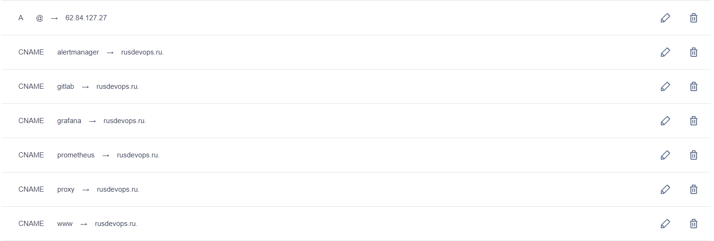  

---
### 2. Подготовим инфраструктуру с помощью `Terraform` на базе облачного провайдера `YandexCloud`

Создадим workspace `stage` 
```bash
terraform workspace new stage
```

Опишем конфигурацию провайдера `Yandex Cloud`

<details><summary>provider.tf</summary>

```bash
# Provider
terraform {
  required_providers {
    yandex = {
      source = "yandex-cloud/yandex"
    }
  }
}

provider "yandex" {
  service_account_key_file = "key.json"
  cloud_id                 = var.yandex_cloud_id
  folder_id                = var.yandex_folder_id
}
```
</details>


Создадим s3 бакет для хранения конфигруации `terraform.tfstate`

<details><summary>s3_bucket_yc.tf</summary>
 
 ```bash
 terraform {
   backend "s3" {
     endpoint             = "storage.yandexcloud.net"
     bucket               = "rusdevops-bucket"
     region               = "ru-central1"
     workspace_key_prefix = "environments"
     key                  = "terraform.tfstate"
     access_key           = "****"
     secret_key           = "****"
 
     skip_region_validation      = true
     skip_credentials_validation = true
   }
 }
```
</details>

Опишем конфигурацию сети и добавим таблицу маршрутизации для `NAT` инстанса

<details><summary>network.tf</summary>

```bash
# Network
resource "yandex_vpc_network" "net" {
  name = "net"
}

resource "yandex_vpc_route_table" "nat-route-table" {
  description = "route table for subnet" 
  name        = "nat-route-table"
  network_id = yandex_vpc_network.net.id
  depends_on = [ yandex_compute_instance.proxy]
static_route {
    destination_prefix = "0.0.0.0/0"
    next_hop_address   = yandex_compute_instance.proxy.network_interface.0.ip_address
    
  }
}

# Subnet
resource "yandex_vpc_subnet" "subnet-nat" {
  name           = "subnet-nat"
  zone           = "ru-central1-a"
  network_id     = yandex_vpc_network.net.id
  v4_cidr_blocks = ["10.2.1.0/24"]
}

# Subnet-nat
resource "yandex_vpc_subnet" "subnet" {
  name           = "subnet"
  zone           = "ru-central1-a"
  network_id     = yandex_vpc_network.net.id
  route_table_id = yandex_vpc_route_table.nat-route-table.id
  v4_cidr_blocks = ["10.2.2.0/24"]
}
```
</details>

Опишем `output` для вывода информации об инстансах `(internal_ip, external_ip, fqdn)`

<details><summary>output.tf</summary>

```bash
# Proxy
output "internal_ip_proxy" {
  description = "The internal IP address of the instance"
  value       = yandex_compute_instance.proxy.network_interface.0.ip_address
}

output "external_ip_proxy" {
  description = "The external IP address of the instance"
  value       = yandex_compute_instance.proxy.network_interface.0.nat_ip_address
}

output "fqdn_proxy" {
  description = "The fully qualified DNS name of this instance"
  value       = yandex_compute_instance.proxy.fqdn
}

# db01
output "internal_ip_db01" {
  description = "The internal IP address of the instance"
  value       = yandex_compute_instance.db01.network_interface.0.ip_address
}
output "fqdn_db01" {
  description = "The fully qualified DNS name of this instance"
  value       = yandex_compute_instance.db01.fqdn
}

# db02
output "internal_ip_db02" {
  description = "The internal IP address of the instance"
  value       = yandex_compute_instance.db02.network_interface.0.ip_address
}
output "fqdn_db02" {
  description = "The fully qualified DNS name of this instance"
  value       = yandex_compute_instance.db02.fqdn
}

# app
output "internal_ip_app" {
  description = "The internal IP address of the instance"
  value       = yandex_compute_instance.app.network_interface.0.ip_address
}
output "fqdn_app" {
  description = "The fully qualified DNS name of this instance"
  value       = yandex_compute_instance.app.fqdn
}

# gitlab
output "internal_ip_gitlab" {
  description = "The internal IP address of the instance"
  value       = yandex_compute_instance.gitlab.network_interface.0.ip_address
}
output "fqdn_gitlab" {
  description = "The fully qualified DNS name of this instance"
  value       = yandex_compute_instance.gitlab.fqdn
}

# runner
output "internal_ip_runner" {
  description = "The internal IP address of the instance"
  value       = yandex_compute_instance.runner.network_interface.0.ip_address
}
output "fqdn_runner" {
  description = "The fully qualified DNS name of this instance"
  value       = yandex_compute_instance.runner.fqdn
}

# monitoring
output "internal_ip_monitoring" {
  description = "The internal IP address of the instance"
  value       = yandex_compute_instance.monitoring.network_interface.0.ip_address
}
output "fqdn_monitoring" {
  description = "The fully qualified DNS name of this instance"
  value       = yandex_compute_instance.monitoring.fqdn
}

```
</details>

Опишем конфигурацию инстанса с `reverse proxy` и `NAT`

<details><summary>01_proxy.tf</summary>

```bash
data "yandex_compute_image" "nat-image" {
  family = "nat-instance-ubuntu"
}
resource "yandex_compute_instance" "proxy" {
  name                      = "proxy"
  zone                      = "ru-central1-a"
  hostname                  = "proxy.rusdevops.ru"
  allow_stopping_for_update = true

  resources {
    cores  = 2
    memory = 2
  }

  boot_disk {
    initialize_params {
      image_id = "${data.yandex_compute_image.nat-image.id}"
      name     = "root-proxy"
      type     = "network-ssd"
      size     = "10"
    }
  }

  network_interface {
    subnet_id  = yandex_vpc_subnet.subnet-nat.id
    nat        = true
    ip_address = "10.2.1.10"
    nat_ip_address = "62.84.127.27"
  }

  metadata = {
    ssh-keys = "ubuntu:${file("~/.ssh/id_rsa.pub")}"
  }
}

```
</details>

Опишем конфигурацию инстансов для `MYSQL` кластера Master/Slave `(db01, db02)` 

<details><summary>02_db01.tf</summary>

```bash
resource "yandex_compute_instance" "db01" {
  name                      = "db01"
  zone                      = "ru-central1-a"
  hostname                  = "db01.rusdevops.ru"
  allow_stopping_for_update = true

  resources {
    cores  = 2
    memory = 2
  }

  boot_disk {
    initialize_params {
      image_id = var.ubuntu_20
      name     = "root-db01"
      type     = "network-ssd"
      size     = "10"
    }
  }

  network_interface {
    subnet_id  = yandex_vpc_subnet.subnet.id
    nat        = false
    ip_address = "10.2.2.11"
  }

  metadata = {
    ssh-keys = "ubuntu:${file("~/.ssh/id_rsa.pub")}"
  }
}

```
</details>

<details><summary>03_db02.tf</summary>

```bash
resource "yandex_compute_instance" "db02" {
  name                      = "db02"
  zone                      = "ru-central1-a"
  hostname                  = "db02.rusdevops.ru"
  allow_stopping_for_update = true

  resources {
    cores  = 2
    memory = 2
  }

  boot_disk {
    initialize_params {
      image_id = var.ubuntu_20
      name     = "root-db02"
      type     = "network-ssd"
      size     = "10"
    }
  }

  network_interface {
    subnet_id  = yandex_vpc_subnet.subnet.id
    nat        = false
    ip_address = "10.2.2.12"
  }

  metadata = {
    ssh-keys = "ubuntu:${file("~/.ssh/id_rsa.pub")}"
  }
}

```
</details>

Опишем конфигурацию инстанса для `Wordpress`

<details><summary>04_app.tf</summary>

```bash
resource "yandex_compute_instance" "app" {
  name                      = "app"
  zone                      = "ru-central1-a"
  hostname                  = "app.rusdevops.ru"
  allow_stopping_for_update = true

  resources {
    cores  = 2
    memory = 2
  }

  boot_disk {
    initialize_params {
      image_id = var.ubuntu_20
      name     = "root-app"
      type     = "network-ssd"
      size     = "10"
    }
  }

  network_interface {
    subnet_id  = yandex_vpc_subnet.subnet.id
    nat        = false
    ip_address = "10.2.2.13"
  }

  metadata = {
    ssh-keys = "ubuntu:${file("~/.ssh/id_rsa.pub")}"
  }
}
```
</details>

Опишем конфигурацию инстанса для `Gitlab`

<details><summary>05_gitlab.tf</summary>

```bash
resource "yandex_compute_instance" "gitlab" {
  name                      = "gitlab"
  zone                      = "ru-central1-a"
  hostname                  = "gitlab.rusdevops.ru"
  allow_stopping_for_update = true

  resources {
    cores  = 4
    memory = 4
  }

  boot_disk {
    initialize_params {
      image_id = var.ubuntu_20
      name     = "root-gitlab"
      type     = "network-ssd"
      size     = "10"
    }
  }

  network_interface {
    subnet_id  = yandex_vpc_subnet.subnet.id
    nat        = false
    ip_address = "10.2.2.14"
  }

  metadata = {
    ssh-keys = "ubuntu:${file("~/.ssh/id_rsa.pub")}"
  }
}

```
</details>

Опишем конфигурацию инстанса для `Gitlab Runner`

<details><summary>06_runner.tf</summary>

```bash
resource "yandex_compute_instance" "runner" {
  name                      = "runner"
  zone                      = "ru-central1-a"
  hostname                  = "runner.rusdevops.ru"
  allow_stopping_for_update = true

  resources {
    cores  = 2
    memory = 2
  }

  boot_disk {
    initialize_params {
      image_id = var.ubuntu_20
      name     = "root-runner"
      type     = "network-ssd"
      size     = "10"
    }
  }

  network_interface {
    subnet_id  = yandex_vpc_subnet.subnet.id
    nat        = false
    ip_address = "10.2.2.15"
  }

  metadata = {
    ssh-keys = "ubuntu:${file("~/.ssh/id_rsa.pub")}"
  }
}

```
</details>

Опишем конфигурацию инстанса для систем мониторинга `(Prometheus, Grafana, Alertmanager)`

<details><summary>07_monitoring.tf</summary>

```bash
resource "yandex_compute_instance" "monitoring" {
  name                      = "monitoring"
  zone                      = "ru-central1-a"
  hostname                  = "monitoring.rusdevops.ru"
  allow_stopping_for_update = true

  resources {
    cores  = 2
    memory = 2
  }

  boot_disk {
    initialize_params {
      image_id = var.ubuntu_20
      name     = "root-monitoring"
      type     = "network-ssd"
      size     = "10"
    }
  }

  network_interface {
    subnet_id  = yandex_vpc_subnet.subnet.id
    nat        = false
    ip_address = "10.2.2.16"
  }

  metadata = {
    ssh-keys = "ubuntu:${file("~/.ssh/id_rsa.pub")}"
  }
}

```
</details>

Опишем конфигурацию для автоматического создания файла `inventory` для `Ansible`

<details><summary>inventory.tf</summary>

```bash
resource "local_file" "inventory" {
  content = <<-DOC
  # Ansible inventory by Terraform.
  
  [all:children]
  proxy
  app
  db
  gitlab
  monitoring
  
  [jump:children]
  app
  db
  gitlab
  monitoring
  
  [db:children]
  db01
  db02 
  
  [gitlab:children]
  gitlab_web
  runner
  
  [proxy]
  proxy.rusdevops.ru ansible_host=${yandex_compute_instance.proxy.network_interface.0.nat_ip_address} 
  
  [db01]
  db01.rusdevops.ru ansible_host=${yandex_compute_instance.db01.network_interface.0.ip_address} 
  
  [db02]
  db02.rusdevops.ru ansible_host=${yandex_compute_instance.db02.network_interface.0.ip_address} 
  
  [app]
  app.rusdevops.ru ansible_host=${yandex_compute_instance.app.network_interface.0.ip_address} 
  
  [gitlab_web]
  gitlab.rusdevops.ru ansible_host=${yandex_compute_instance.gitlab.network_interface.0.ip_address} 
  
  [runner]
  runner.rusdevops.ru ansible_host=${yandex_compute_instance.runner.network_interface.0.ip_address} 

  [monitoring]
  monitoring.rusdevops.ru ansible_host=${yandex_compute_instance.monitoring.network_interface.0.ip_address} 

  [jump:vars]
  ansible_ssh_common_args='-o ProxyCommand="ssh -W %h:%p -q ${var.linux_user}@${yandex_compute_instance.proxy.network_interface.0.nat_ip_address}"'
  
  [all:vars]
  ansible_ssh_common_args='-o StrictHostKeyChecking=no'
  ansible_user=${var.linux_user}
    DOC
  filename = "../../ansible/inventory"

  depends_on = [
    yandex_compute_instance.proxy,
    yandex_compute_instance.db01,
    yandex_compute_instance.db02,
    yandex_compute_instance.app,
    yandex_compute_instance.gitlab,
    yandex_compute_instance.runner,
    yandex_compute_instance.monitoring,
  ]
}

```
</details>

Опишем переменные для `Terraform`

<details><summary>variables.tf</summary>

```bash
# ID облака
variable "yandex_cloud_id" {
  default = "****"
}

# Folder облака
variable "yandex_folder_id" {
  default = "****"
}

# ID образа
variable "ubuntu_20" {
  default = "****"
}

# User
variable "linux_user" {
  default = "ubuntu"
}
```
</details>

Развернем инфраструктуру в `Yandex Cloud`
```bash
terraform apply -auto-approve
```

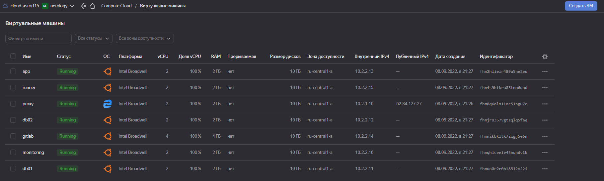

---

### 3. Настроим внешний `Reverse Proxy` на основе `Nginx` и `LetsEncrypt`.

Подготовим Ansible роли [install-proxy](https://github.com/astorf15/net.devops/tree/main/homework/diplom-netology/stack/ansible/roles/install-proxy) для установки и настройки Nginx и LetsEncrypt , пропишем конфигурационные файлы для форвардинга на нужные subdomains.

```bash
.
├── defaults
│   └── main.yml
├── files
│   ├── conf.d
│   │   ├── alertmanager.rusdevops.ru.conf
│   │   ├── custom-nginx
│   │   ├── gitlab.rusdevops.ru.conf
│   │   ├── grafana.rusdevops.ru.conf
│   │   ├── prometheus.rusdevops.ru.conf
│   │   └── rusdevops.ru.conf
│   ├── snippets
│   │   ├── proxy.conf
│   │   └── ssl.conf
│   └── ssl
│       └── dhparams4096.pem
├── handlers
│   └── main.yml
└── tasks
    ├── certbot-install-snap.yml
    ├── main.yml
    └── renew-cron.yml

7 directories, 14 files
```
---

### 4. Настроим кластер `MySQL` 

Подготовим Ansible роли [install-mysql-db01](https://github.com/astorf15/net.devops/tree/main/homework/diplom-netology/stack/ansible/roles/install-mysql-db01), [install-mysql-db02](https://github.com/astorf15/net.devops/tree/main/homework/diplom-netology/stack/ansible/roles/install-mysql-db02) для установки и настройки кластера MYSQL (Master-Slave) с помощью Docker-Compose.

```bash
# DB01 - Master
.
├── files
│   ├── docker-compose-mysql.yml
│   ├── master.cnf
│   └── master.sql - создает пользователя replic и дает ему права на репликацию, файл помещается в docker-entrypoint для автоматического запуска.
└── tasks
    └── main.yml

# DB02 - Slave    
.
├── files
│   ├── docker-compose-mysql.yml
│   ├── slave.cnf
│   └── slave.sql - задает параметры подключения к мастеру
└── tasks
    └── main.yml
```
<details><summary>SHOW MASTER STATUS</summary>

```sql
mysql> show master status;
+------------------+----------+--------------+------------------+-------------------+
| File             | Position | Binlog_Do_DB | Binlog_Ignore_DB | Executed_Gtid_Set |
+------------------+----------+--------------+------------------+-------------------+
| mysql-bin.000004 |      156 | wordpress    |                  |                   |
+------------------+----------+--------------+------------------+-------------------+
1 row in set (0.00 sec)
```
</details>

<details><summary>SHOW PROCESSLIST</summary>

```sql
mysql> SHOW PROCESSLIST;
+----+-----------------+-------------------------+------+-------------+------+-----------------------------------------------------------------+------------------+
| Id | User            | Host                    | db   | Command     | Time | State                                                           | Info             |
+----+-----------------+-------------------------+------+-------------+------+-----------------------------------------------------------------+------------------+
|  5 | event_scheduler | localhost               | NULL | Daemon      |  403 | Waiting on empty queue                                          | NULL             |
|  9 | root            | localhost               | NULL | Query       |    0 | init                                                            | SHOW PROCESSLIST |
| 10 | replic          | db02.rusdevops.ru:53330 | NULL | Binlog Dump |   31 | Source has sent all binlog to replica; waiting for more updates | NULL             |
+----+-----------------+-------------------------+------+-------------+------+-----------------------------------------------------------------+------------------+
3 rows in set (0.00 sec)
```
</details>

<details><summary>SHOW SLAVE STATUS</summary>

```sql
mysql> show slave status\G
*************************** 1. row ***************************
               Slave_IO_State: Waiting for source to send event
                  Master_Host: 10.2.2.11
                  Master_User: replic
                  Master_Port: 3306
                Connect_Retry: 60
              Master_Log_File: mysql-bin.000003
          Read_Master_Log_Pos: 771737
               Relay_Log_File: mysql-relay-bin.000005
                Relay_Log_Pos: 771952
        Relay_Master_Log_File: mysql-bin.000003
             Slave_IO_Running: Yes
            Slave_SQL_Running: Yes
              Replicate_Do_DB: wordpress
          Replicate_Ignore_DB: 
           Replicate_Do_Table: 
       Replicate_Ignore_Table: 
      Replicate_Wild_Do_Table: 
  Replicate_Wild_Ignore_Table: 
                   Last_Errno: 0
                   Last_Error: 
                 Skip_Counter: 0
          Exec_Master_Log_Pos: 771737
              Relay_Log_Space: 773117
              Until_Condition: None
               Until_Log_File: 
                Until_Log_Pos: 0
           Master_SSL_Allowed: No
           Master_SSL_CA_File: 
           Master_SSL_CA_Path: 
              Master_SSL_Cert: 
            Master_SSL_Cipher: 
               Master_SSL_Key: 
        Seconds_Behind_Master: 0
Master_SSL_Verify_Server_Cert: No
                Last_IO_Errno: 0
                Last_IO_Error: 
               Last_SQL_Errno: 0
               Last_SQL_Error: 
  Replicate_Ignore_Server_Ids: 
             Master_Server_Id: 1
                  Master_UUID: 8bd4a10a-2fad-11ed-b755-d00d1ec0362d
             Master_Info_File: mysql.slave_master_info
                    SQL_Delay: 0
          SQL_Remaining_Delay: NULL
      Slave_SQL_Running_State: Replica has read all relay log; waiting for more updates
           Master_Retry_Count: 86400
                  Master_Bind: 
      Last_IO_Error_Timestamp: 
     Last_SQL_Error_Timestamp: 
               Master_SSL_Crl: 
           Master_SSL_Crlpath: 
           Retrieved_Gtid_Set: 
            Executed_Gtid_Set: 
                Auto_Position: 0
         Replicate_Rewrite_DB: 
                 Channel_Name: 
           Master_TLS_Version: 
       Master_public_key_path: 
        Get_master_public_key: 0
            Network_Namespace: 
1 row in set, 1 warning (0.01 sec)
```
</details>

<details><summary>SHOW TABLES</summary>

```sql
mysql> SHOW TABLES;
+-----------------------+
| Tables_in_wordpress   |
+-----------------------+
| wp_commentmeta        |
| wp_comments           |
| wp_links              |
| wp_options            |
| wp_postmeta           |
| wp_posts              |
| wp_term_relationships |
| wp_term_taxonomy      |
| wp_termmeta           |
| wp_terms              |
| wp_usermeta           |
| wp_users              |
+-----------------------+
12 rows in set (0.00 sec)
```
</details>

---

### 5. Установим WordPress.
Подготовим Ansible роль [install-app](https://github.com/astorf15/net.devops/tree/main/homework/diplom-netology/stack/ansible/roles/install-app) для установки и настройки Wordpress с помощью Docker-Compose

```bash
.
├── files
│   └── docker-compose-app.yml
└── tasks
    └── main.yml

2 directories, 2 files
```
Откроем браузер, введем адрес домена `rusdevops.ru` и убедимся что страница открывается по `HTTPS`.  

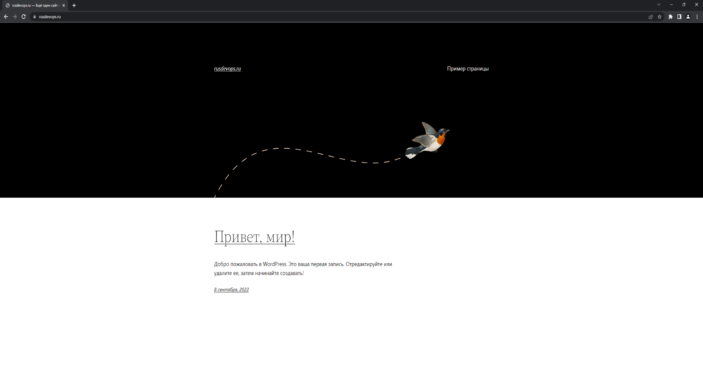
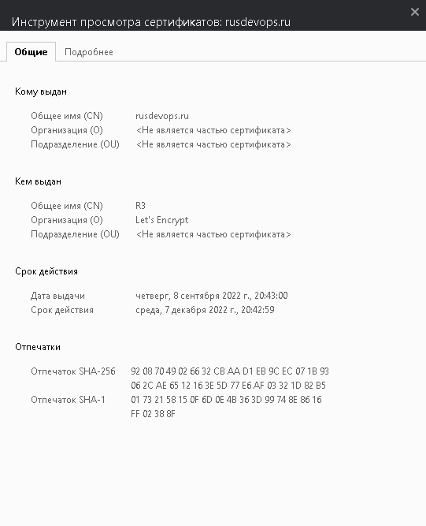

---

### 6. Установим Gitlab CE и Gitlab Runner.
Подготовим Ansible роль [install-gitlab](https://github.com/astorf15/net.devops/tree/main/homework/diplom-netology/stack/ansible/roles/install-gitlab) для установки и настройки Gitlab CE

```bash
.
├── defaults
│   └── main.yml
├── files
│   └── gitlab_add_repo.sh
├── handlers
│   └── main.yml
├── tasks
│   └── main.yml
├── templates
│   └── gitlab.rb.j2
└── vars
    └── Debian.yml

6 directories, 6 files
```
Подключимся к серверу по ssh и получим ROOT пароль из файла.

```bash
cat /etc/gitlab/initial_root_password
```

После перейдем по адресу `gitlab.rusdevops.ru` и зарегистрируем новую учетную запись с прававми администратора и создадим репозиторий с именем `Diplom`

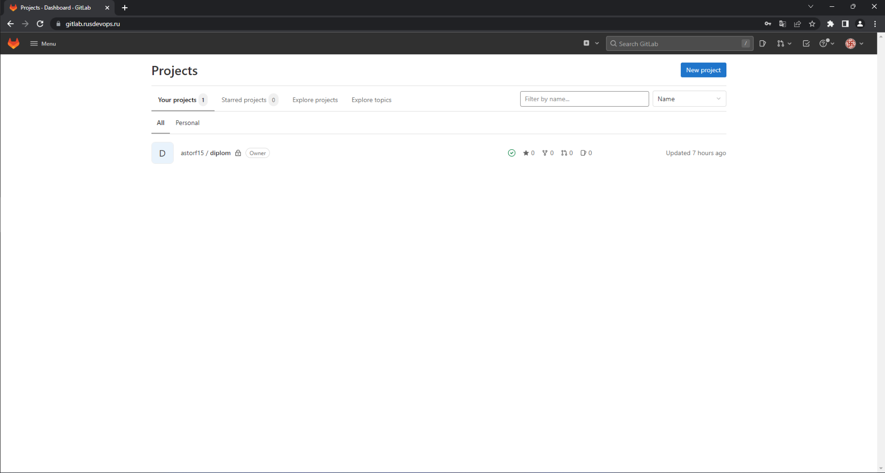

Подготовим Ansible роль [install-runner](https://github.com/astorf15/net.devops/tree/main/homework/diplom-netology/stack/ansible/roles/install-runner) для установки и настройки Gitlab runner

```bash
.
├── files
│   └── docker-compose-runner.yml
└── tasks
    └── main.yml

2 directories, 2 files
```
### 7. Настроим `CI/CD` для автоматического развёртывания приложения. 

Добавим runner к проекту на Gitlab

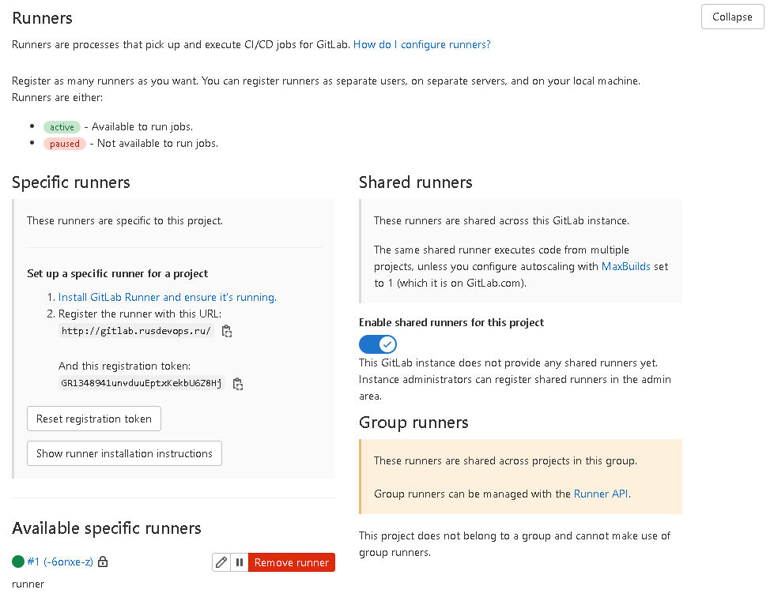

Создадим pipeline [.gitlab-ci.yml](https://github.com/astorf15/net.devops/blob/main/homework/diplom-netology/stack/ansible/roles/install-runner/.gitlab-ci.yml) и выполним Push проекта в репозиторий

Перейдем в настройки `CI/CD` проекта и добавим переменную `SSH_PRIVATE_KEY` для возможнсоти подключения гитлаб раннера к серверу с `Wordpress`

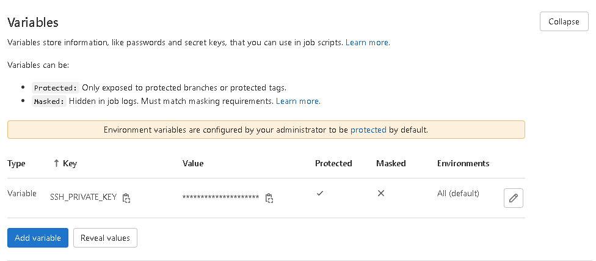


Создадим файл `index.html` , сделаем коммит и выполним push в репозиторий, после чего перейдем в `Gitlab` и проверим автоматический deploy нашего файла на сервер.

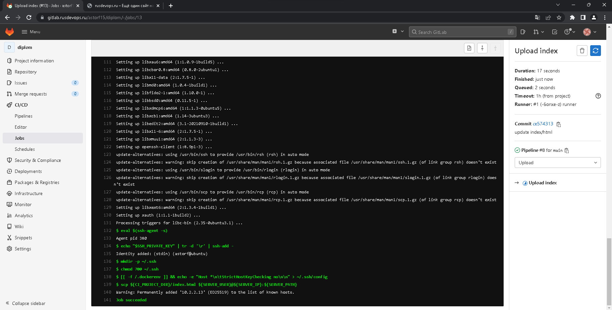

После успешного выполнения перейдем на страницу нашего сайта `https://rusdevops.ru/index.html` и посмотрим результат автоматической доставки. 

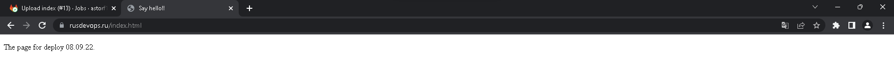

### 8. Настроим мониторинг инфраструктуры с помощью стека: `Prometheus, Alert Manager и Grafana.`

Подготовим Ansible роль [install-monitoring](https://github.com/astorf15/net.devops/tree/main/homework/diplom-netology/stack/ansible/roles/install-monitoring) для установки и настройки Prometheus, Alert Manager и Grafana на основе сервисов в Docker-Compose

```bash
.
├── files
│   ├── alertmanager
│   │   └── config.yml
│   ├── docker-compose-monitoring.yml
│   ├── grafana
│   │   ├── dashboards
│   │   │   └── Node_exporter_dashboard.json
│   │   └── provisioning
│   │       ├── dashboards
│   │       │   └── dashboards.yml
│   │       └── datasources
│   │           └── prometheus.yml
│   └── prometheus
│       ├── alert.rules
│       └── prometheus.yml
└── tasks
    └── main.yml

9 directories, 8 files   
```

Подготовим Ansible роль [Node Exporter](https://github.com/astorf15/net.devops/tree/main/homework/diplom-netology/stack/ansible/roles/install-node-exporter), развернем в Docker-Compose на всех инстансах и добавим их ip в [prometheus.yml](https://github.com/astorf15/net.devops/blob/main/homework/diplom-netology/stack/ansible/roles/install-monitoring/files/prometheus/prometheus.yml).
Откроем Grafana и проверим работу серисов.

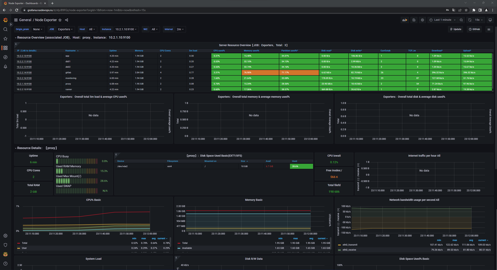

Добавим правила и оповещения [alert.rules](https://github.com/astorf15/net.devops/blob/main/homework/diplom-netology/stack/ansible/roles/install-monitoring/files/prometheus/alert.rules) в `Prometheus` и настроим отправку оповещения в случае сбоя в телеграм бот с помощью `Alertmanager`

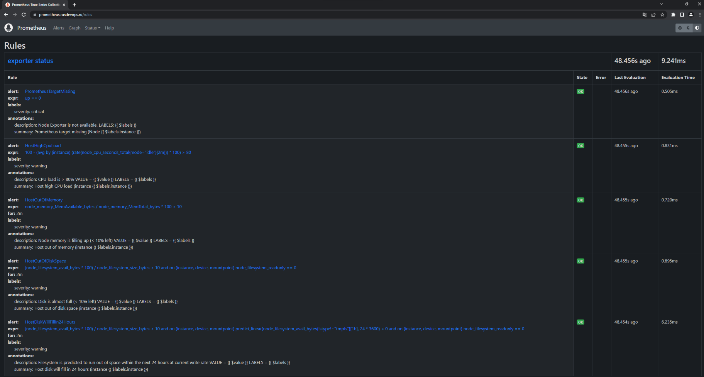
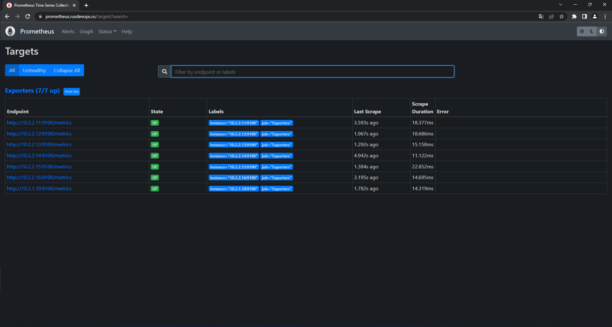
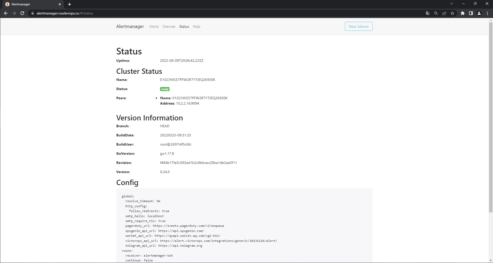

---
### 9. Настроим `sshd_config` 
Подготовим Ansible роль [configure-ssh](https://github.com/astorf15/net.devops/tree/main/homework/diplom-netology/stack/ansible/roles/configure-ssh) для настройки ssh, отключим root доступ, подключение по паролю, при желании изменим порт.

```bash
.
├── handlers
│   └── main.yml
├── tasks
│   └── main.yml
└── templates
    └── sshd_config.j2

3 directories, 3 files
```
---
### 10. Закроем входящий трафик на `reverse proxy` сервере за исключением нескольких портов добавив правила файрволла в `iptables`
Подготовим Ansible роль [iptables-rules](https://github.com/astorf15/net.devops/tree/main/homework/diplom-netology/stack/ansible/roles/iptables-rules) и пропишем правила на входящий трафик

```bash
.
├── handlers
│   └── main.yml
└── tasks
    └── main.yml
```
### CHAIN INPUT RULES

```bash
Chain INPUT (policy ACCEPT)
num  target     prot opt source               destination         
1    ACCEPT     all  --  0.0.0.0/0            0.0.0.0/0            /* Allow loopback */
2    ACCEPT     all  --  0.0.0.0/0            0.0.0.0/0            ctstate RELATED,ESTABLISHED /* Allow related and established connections */
3    ACCEPT     icmp --  0.0.0.0/0            0.0.0.0/0            /* Allow icmp Ping */
4    ACCEPT     tcp  --  0.0.0.0/0            0.0.0.0/0            tcp dpt:80 /* Allow HTTP */
5    ACCEPT     tcp  --  0.0.0.0/0            0.0.0.0/0            tcp dpt:443 /* Allow HTTPS */
6    ACCEPT     tcp  --  0.0.0.0/0            0.0.0.0/0            tcp dpt:22 /* Allow SSH */
7    DROP       all  --  0.0.0.0/0            0.0.0.0/0            /* Drop all */
```
---

## Финал практикума, ссылки на репозиторий и сервисы

1. Репозиторий с `Terraform` манифестами:  [Yndex-instances](https://github.com/astorf15/net.devops/tree/main/homework/diplom-netology/stack/terrform)
2. Репозиторий с `Ansible` ролями: [Ansible-Roles](https://github.com/astorf15/net.devops/tree/main/homework/diplom-netology/stack/ansible)
3. Ansible-playbook: [deploy-stack.yml](https://github.com/astorf15/net.devops/blob/main/homework/diplom-netology/stack/ansible/deploy-stack.yml)

Сервисы:
* [https://www.rusdevops.ru (WordPress)](#5-установим-wordpress)
* [https://gitlab.rusdevops.ru (Gitlab)](#6-установим-gitlab-ce-и-gitlab-runner)
* [https://grafana.rusdevops.ru (Grafana)](#8-настроим-мониторинг-инфраструктуры-с-помощью-стека-prometheus-alert-manager-и-grafana)
* [https://prometheus.rusdevops.ru (Prometheus)](#8-настроим-мониторинг-инфраструктуры-с-помощью-стека-prometheus-alert-manager-и-grafana)
* [https://alertmanager.rusdevops.ru (Alert Mansger)](#8-настроим-мониторинг-инфраструктуры-с-помощью-стека-prometheus-alert-manager-и-grafana)

## [Видео инсталяция инфраструктуры ](https://www.youtube.com/watch?v=nIkqL5Z_VpE)